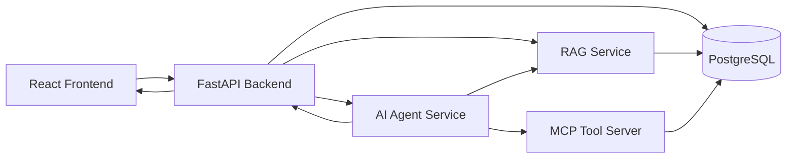
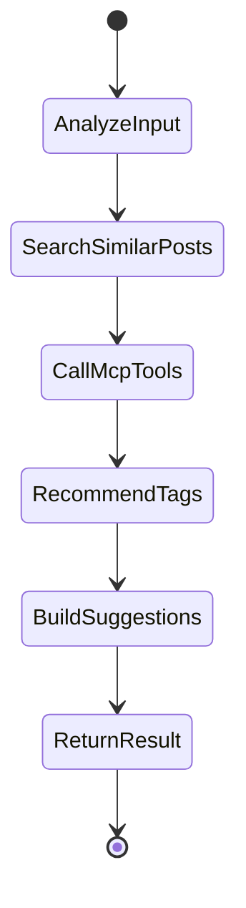

# Local Board RAG, MCP, AI Agent 구현 계획서

대상 프로젝트: `C:\jungle6\week15\hyeok\local_board`

## 1. 문서 목적

이 문서는 현재 게시판 프로젝트에 필수 AI 요소인 RAG, MCP, AI Agent를 붙이기 전에 다음 내용을 정리하기 위한 구현 지침서입니다.

- RAG, MCP, AI Agent가 각각 무엇인지
- 우리 게시판 서비스에서는 어떤 기능으로 구현하는 것이 현실적인지
- 백엔드, 프론트엔드, DB를 어떤 순서로 바꿔야 하는지
- 5주 또는 짧은 구현 기간 안에서 어디까지를 MVP로 잡아야 하는지
- 발표 때 어떤 흐름으로 보여주면 좋은지

현재 서비스는 동네 가게 Q&A 게시판입니다. 따라서 AI 기능도 거창한 범용 챗봇보다 “게시판 데이터와 사용자 질문을 더 잘 연결하는 기능”으로 좁히는 것이 좋습니다.

---

## 2. 최종 추천 방향

### 추천 MVP 이름

동네 가게 Q&A AI 도우미

### 한 줄 설명

사용자가 동네 가게에 대해 질문글을 작성하면, AI가 기존 게시글과 댓글을 검색해 비슷한 질문을 찾아주고, 태그를 추천하며, 필요하면 외부 도구(MCP)를 호출해 추가 맥락을 붙여주는 게시판 보조 Agent입니다.

### 왜 이 방향이 좋은가

- 현재 이미 게시글, 댓글, 태그, 검색, 정렬 기능이 있습니다.
- RAG는 기존 게시글/댓글 데이터를 검색하는 기능으로 자연스럽게 붙일 수 있습니다.
- MCP는 외부 도구 호출 구조를 보여주기 좋습니다.
- AI Agent는 RAG와 MCP를 묶어서 “스스로 판단하고 단계적으로 도와주는 흐름”으로 설명할 수 있습니다.
- 사용자가 초보자여도 구현 단계를 나눠 이해하기 쉽습니다.

---

## 3. 기능 범위 정리

## 3.1 must-have

반드시 구현할 기능입니다.

1. 게시글 RAG 검색
   - 사용자가 입력한 질문과 비슷한 게시글을 찾아줍니다.
   - 검색 대상은 게시글 제목, 내용, 댓글 일부, 태그입니다.
   - 결과는 “비슷한 게시글 3~5개”로 보여줍니다.

2. AI 태그 추천
   - 사용자가 글을 작성할 때 제목/내용을 보고 태그를 추천합니다.
   - 추천 태그는 기존 태그를 우선 사용합니다.
   - 없는 태그는 새 태그 후보로 제안합니다.

3. AI 질문 작성 도우미
   - 사용자가 작성한 글이 너무 짧거나 모호하면 보완 질문을 제안합니다.
   - 예: “가격대”, “대기 시간”, “방문 시간대”, “원하는 분위기” 같은 항목을 더 적도록 안내합니다.

4. MCP 도구 호출 시연
   - AI Agent가 직접 함수/도구를 호출하는 구조를 만듭니다.
   - MVP에서는 실제 외부 사이트 대신, 우리 게시판 DB를 조회하는 MCP Tool부터 시작합니다.

5. Agent 실행 로그
   - Agent가 어떤 단계를 거쳤는지 화면 또는 DB에 남깁니다.
   - 예: `질문 분석 -> 유사 게시글 검색 -> 태그 추천 -> 답변 생성`

## 3.2 nice-to-have

시간이 되면 구현합니다.

1. 댓글까지 포함한 더 정교한 RAG 답변 생성
2. 카테고리별 추천 질문 템플릿
3. AI가 비슷한 게시글을 근거로 “이미 답변된 질문일 수 있음” 표시
4. MCP 서버를 별도 프로세스로 실행
5. LangGraph 기반 상태 그래프 도입
6. 사용자가 Agent 결과를 채택/무시한 기록 저장

## 3.3 demo-only

발표 시연용으로 충분한 기능입니다.

1. OpenAI API가 없어도 동작하는 mock AI 응답
2. 실제 MCP 표준 서버가 완벽하지 않아도 “도구 호출 구조”를 보여주는 간단한 MCP-like 서버
3. 실제 vector DB가 어려우면 1차로 키워드 검색 + 태그 검색 기반 RAG 시연

---

## 4. 전체 아키텍처



### 데이터 흐름

```text
1. 사용자가 게시글 작성 화면에서 제목/내용을 입력합니다.
2. 프론트가 FastAPI에 AI 도움 요청을 보냅니다.
3. FastAPI의 Agent Service가 요청을 받습니다.
4. Agent가 먼저 RAG Service로 비슷한 게시글을 검색합니다.
5. Agent가 MCP Tool을 호출해 게시판 DB 검색, 태그 목록 조회 같은 도구 작업을 수행합니다.
6. Agent가 결과를 합쳐 태그 추천, 비슷한 글, 작성 보완 제안을 만듭니다.
7. 프론트가 결과를 게시글 작성 화면 옆에 표시합니다.
```

---

## 5. RAG 기능 설계

## 5.1 RAG 정의

RAG는 Retrieval-Augmented Generation의 약자입니다.

쉽게 말하면, AI가 그냥 상상해서 답하는 것이 아니라 먼저 DB나 문서에서 관련 정보를 찾아온 뒤, 그 정보를 근거로 답변하는 방식입니다.

게시판 프로젝트에서는 다음처럼 설명하면 됩니다.

```text
RAG는 사용자의 새 질문과 비슷한 기존 게시글/댓글을 먼저 검색하고,
그 검색 결과를 근거로 AI가 태그 추천, 중복 질문 안내, 작성 보완 제안을 해주는 기능입니다.
```

## 5.2 우리 프로젝트에서의 RAG 기능

### 기능 1. 유사 게시글 추천

입력:

```json
{
  "title": "둔전역 근처 야간 진료 치과 있나요?",
  "content": "퇴근하고 갈 수 있는 치과를 찾고 있어요. 스케일링도 같이 받고 싶습니다."
}
```

출력:

```json
{
  "similar_posts": [
    {
      "post_id": 99,
      "title": "프라임치과 친절하고 설명을 잘해주는 편인가요",
      "reason": "치과, 진료, 예약 관련 내용이 유사합니다."
    }
  ]
}
```

### 기능 2. 태그 추천

입력 글에서 핵심 단어를 뽑고 기존 태그와 비교합니다.

예상 출력:

```json
{
  "recommended_tags": ["치과", "둔전역", "스케일링", "예약"]
}
```

### 기능 3. 작성 보완 제안

사용자 글이 짧거나 정보가 부족하면 질문을 제안합니다.

예상 출력:

```json
{
  "suggestions": [
    "방문 가능한 시간대를 적으면 더 좋은 답변을 받을 수 있습니다.",
    "원하는 진료 항목을 함께 적어보세요. 예: 스케일링, 충치치료, 검진"
  ]
}
```

## 5.3 RAG 데이터 설계

### 1차 MVP 방식

처음에는 pgvector 없이 다음 데이터를 조합해 검색합니다.

- 제목 keyword match
- 내용 keyword match
- 태그 match
- 댓글 keyword match

장점:

- 지금 PostgreSQL만으로 구현 가능합니다.
- Docker 이미지 변경이 필요 없습니다.
- 초보자도 SQL을 이해하기 쉽습니다.

단점:

- 의미 기반 검색은 약합니다.
- “치과 추천”과 “스케일링 받을 곳”처럼 표현이 다르면 놓칠 수 있습니다.

### 2차 확장 방식

pgvector를 도입해 embedding 기반 검색을 붙입니다.

필요 변경:

```text
1. Docker PostgreSQL 이미지를 pgvector 지원 이미지로 변경
2. post_embeddings 테이블 추가
3. 게시글 생성/수정 시 embedding 생성
4. 질문 입력 시 query embedding 생성
5. vector similarity로 유사 게시글 검색
```

MVP에서는 1차 키워드 기반 RAG를 먼저 만들고, 발표 전 시간이 남으면 pgvector로 확장하는 것을 추천합니다.

## 5.4 RAG API 설계

```text
POST /ai/rag/similar-posts
```

요청:

```json
{
  "title": "둔전역 근처 야간 진료 치과 있나요?",
  "content": "퇴근 후 갈 수 있는 치과를 찾고 있어요.",
  "limit": 5
}
```

응답:

```json
{
  "items": [
    {
      "post_id": 99,
      "title": "프라임치과 친절하고 설명을 잘해주는 편인가요",
      "category": "치과",
      "store_name": "프라임치과",
      "score": 8,
      "matched_terms": ["치과", "진료"]
    }
  ]
}
```

## 5.5 RAG 구현 파일 추천

```text
backend/app/routers/ai.py
backend/app/services/rag_service.py
backend/app/schemas/ai.py
```

## 5.6 RAG 구현 순서

```text
R01. ai.py 라우터 생성
R02. AISimilarPostRequest, AISimilarPostResponse 스키마 생성
R03. 제목/내용에서 검색어 추출 함수 작성
R04. posts, comments, tags를 조합해 점수 계산
R05. 점수 높은 게시글 5개 반환
R06. 프론트 게시글 작성 화면에서 API 호출
R07. 유사 게시글 카드 표시
R08. 빈 입력, 검색 결과 없음, 삭제된 게시글 제외 테스트
---V2
R09. 불용어 사전 확장
R10. Kiwipiepy 기반 명사 추출
R11. 키워드 위치별 가중치 개선
R12. pgvector 확장 설정
R13. 게시글 임베딩 테이블 생성
R14. 임베딩 생성/저장 스크립트 작성
R15. 벡터 기반 유사 게시글 검색 API
R16. 기존 키워드 검색과 벡터 검색 하이브리드 통합
R17. LLM 기반 추천 이유 생성
R18. 프론트 결과 UI 개선
```

---

## 6. MCP 기능 설계

## 6.1 MCP 정의

MCP는 Model Context Protocol의 약자입니다.

AI Agent가 외부 도구를 일정한 규칙으로 호출할 수 있게 해주는 연결 표준입니다.

게시판 프로젝트에서는 다음처럼 설명하면 됩니다.

```text
MCP는 AI가 직접 DB 검색, 태그 조회, 게시글 상세 조회 같은 도구를 호출할 수 있게 하는 연결 방식입니다.
```

## 6.2 우리 프로젝트에서의 MCP 역할

MVP에서는 MCP가 거창한 외부 서비스 연동이 아니어도 됩니다.

처음에는 다음 도구를 MCP Tool로 만들면 충분합니다.

```text
tool.search_posts(keyword, category, tag)
tool.get_post_detail(post_id)
tool.list_popular_tags(limit)
tool.get_recent_posts(limit)
```

AI Agent는 이 도구들을 호출해서 답변을 만듭니다.

예시:

```text
사용자: 둔전역 근처 치과 글 쓰려고 하는데 비슷한 글 있어?
Agent:
1. search_posts(keyword="치과", tag="치과") 호출
2. list_popular_tags(limit=10) 호출
3. 유사 게시글과 추천 태그를 사용자에게 반환
```

## 6.3 MCP 구현 수준 선택

### 선택 A. MCP-like 내부 도구부터 구현

추천합니다.

FastAPI 내부에 `ToolService`를 만들고 Agent가 함수처럼 호출합니다.

장점:

- 구현이 쉽습니다.
- 디버깅이 쉽습니다.
- 발표 때 “MCP 도구 호출 구조”를 설명하기 좋습니다.

단점:

- 엄밀한 MCP 표준 서버는 아닙니다.

### 선택 B. 별도 MCP Server 구현

시간이 남으면 도전합니다.

```text
backend/mcp_server/server.py
```

장점:

- MCP라는 요구사항을 더 직접적으로 만족합니다.
- Agent가 외부 도구 서버를 호출하는 구조를 보여줄 수 있습니다.

단점:

- 초보자에게 설정이 어렵습니다.
- stdio/server 실행 구조가 헷갈릴 수 있습니다.
- 프로젝트 완성 속도가 느려질 수 있습니다.

추천은 A를 먼저 구현하고, 이후 B로 확장하는 것입니다.

## 6.4 MCP Tool 응답 예시

```json
{
  "tool_name": "search_posts",
  "arguments": {
    "keyword": "치과",
    "tag": "치과",
    "limit": 5
  },
  "result": [
    {
      "post_id": 99,
      "title": "프라임치과 친절하고 설명을 잘해주는 편인가요",
      "comment_count": 5,
      "view_count": 3
    }
  ]
}
```

## 6.5 MCP 구현 파일 추천

1차 내부 도구 방식:

```text
backend/app/services/tool_service.py
backend/app/services/mcp_service.py
backend/app/schemas/tool.py
```

2차 별도 서버 방식:

```text
backend/mcp_server/server.py
backend/mcp_server/tools.py
```

## 6.6 MCP 구현 순서

```text
M01. ToolResult 스키마 정의
M02. search_posts 도구 함수 작성
M03. get_post_detail 도구 함수 작성
M04. list_popular_tags 도구 함수 작성
M05. 도구 호출 로그를 남기는 wrapper 작성
M06. Agent Service에서 도구를 선택해 호출하도록 연결
M07. 프론트에서 Agent 실행 로그 표시
M08. 시간이 남으면 별도 MCP server로 분리
```

---

## 7. AI Agent 기능 설계

## 7.1 AI Agent 정의

AI Agent는 단순히 한 번 답변하는 챗봇이 아니라, 목표를 이루기 위해 여러 단계를 스스로 진행하는 프로그램입니다.

게시판 프로젝트에서는 다음처럼 설명하면 됩니다.

```text
AI Agent는 사용자의 게시글 작성 의도를 분석하고,
필요하면 RAG 검색과 MCP 도구 호출을 수행한 뒤,
태그 추천, 유사 글 추천, 작성 보완 제안을 한 번에 제공하는 기능입니다.
```

## 7.2 우리 프로젝트 Agent의 목표

게시글 작성 도우미 Agent

사용자가 제목과 내용을 입력하면 Agent가 다음을 수행합니다.

```text
1. 글의 카테고리와 의도를 분석한다.
2. 비슷한 게시글이 있는지 RAG로 검색한다.
3. 게시판 도구를 MCP 방식으로 호출해 인기 태그와 최근 글을 확인한다.
4. 추천 태그를 만든다.
5. 글을 더 잘 쓰기 위한 보완 질문을 만든다.
6. 결과와 실행 단계를 프론트에 반환한다.
```

## 7.3 Agent 실행 단계



## 7.4 Agent API 설계

```text
POST /ai/agent/post-helper
```

요청:

```json
{
  "title": "둔전역 근처 치과 추천해주세요",
  "content": "퇴근하고 갈 수 있는 곳이면 좋겠어요. 스케일링도 생각 중입니다."
}
```

응답:

```json
{
  "intent": "치과 추천 질문",
  "recommended_tags": ["치과", "둔전역", "스케일링", "예약"],
  "similar_posts": [
    {
      "post_id": 99,
      "title": "프라임치과 친절하고 설명을 잘해주는 편인가요",
      "reason": "치과와 예약 관련 내용이 비슷합니다."
    }
  ],
  "writing_suggestions": [
    "방문 가능한 시간대를 적으면 더 좋은 답변을 받을 수 있습니다.",
    "원하는 진료 항목을 구체적으로 적어보세요."
  ],
  "steps": [
    "입력 분석 완료",
    "유사 게시글 검색 완료",
    "인기 태그 조회 완료",
    "추천 결과 생성 완료"
  ]
}
```

## 7.5 Agent 구현 방식

### 1차 MVP: 규칙 기반 Agent

처음에는 LLM 없이도 동작하게 만듭니다.

- 키워드로 intent 추정
- RAG 검색 함수 호출
- 인기 태그 조회
- 규칙 기반 보완 문장 생성

장점:

- API 키 없이 개발 가능합니다.
- 테스트가 쉽습니다.
- 서비스 흐름을 먼저 완성할 수 있습니다.

### 2차 확장: LLM 연결

이후 환경변수에 AI API 키가 있으면 LLM을 사용합니다.

- intent 문장 자연스럽게 생성
- 유사 게시글 reason 생성
- 작성 보완 제안 문장 생성

환경변수 예시:

```text
AI_PROVIDER=openai
AI_MODEL=...
AI_API_KEY=...
```

주의:

- API 키는 절대 Git에 올리지 않습니다.
- `.env.example`에는 이름만 적고 실제 값은 넣지 않습니다.

## 7.6 Agent 구현 파일 추천

```text
backend/app/routers/ai.py
backend/app/services/agent_service.py
backend/app/services/rag_service.py
backend/app/services/tool_service.py
backend/app/schemas/ai.py
```

## 7.7 Agent 구현 순서

```text
A01. /ai/agent/post-helper API 생성
A02. Agent request/response schema 작성
A03. analyze_input 함수 작성
A04. RAG search_similar_posts 함수 연결
A05. ToolService list_popular_tags 연결
A06. recommend_tags 함수 작성
A07. writing_suggestions 함수 작성
A08. steps 배열로 실행 과정 반환
A09. 프론트 글쓰기 화면에 AI 도움 버튼 추가
A10. 결과 패널 표시
```

---

## 8. DB 설계

## 8.1 1차 MVP에서 필요한 테이블

처음에는 새 테이블 없이도 가능합니다.

기존 테이블 사용:

```text
posts
comments
tags
post_tags
```

## 8.2 Agent 실행 로그 저장용 테이블

발표에서 Agent가 “어떤 생각과 도구 호출을 했는지” 보여주려면 로그 테이블을 추가하는 것이 좋습니다.

```sql
create table ai_agent_runs (
    id serial primary key,
    user_id integer references users(id),
    input_title varchar(100) not null,
    input_content text not null,
    intent varchar(100),
    result_json jsonb not null default '{}'::jsonb,
    created_at timestamp not null default now()
);

create table ai_agent_steps (
    id serial primary key,
    run_id integer not null references ai_agent_runs(id) on delete cascade,
    step_order integer not null,
    step_name varchar(100) not null,
    tool_name varchar(100),
    input_json jsonb not null default '{}'::jsonb,
    output_json jsonb not null default '{}'::jsonb,
    created_at timestamp not null default now()
);
```

## 8.3 2차 pgvector 확장 테이블

시간이 남으면 추가합니다.

```sql
create extension if not exists vector;

create table post_embeddings (
    id serial primary key,
    post_id integer not null references posts(id) on delete cascade,
    source_type varchar(20) not null,
    source_text text not null,
    embedding vector(1536),
    created_at timestamp not null default now(),
    updated_at timestamp not null default now()
);
```

주의:

- 현재 Docker 이미지가 pgvector를 지원하지 않을 수 있습니다.
- pgvector를 쓰려면 Docker 이미지를 바꾸거나 extension 설치 가능 여부를 확인해야 합니다.
- 그래서 MVP는 키워드 기반 RAG부터 시작하는 것이 안전합니다.

---

## 9. 프론트엔드 화면 설계

## 9.1 게시글 작성 화면에 추가할 UI

현재 글쓰기 화면 옆 또는 아래에 AI 도움 패널을 추가합니다.

버튼:

```text
AI 도움 받기
```

결과 패널:

```text
추천 태그
- 치과
- 둔전역
- 스케일링

비슷한 게시글
- 프라임치과 친절하고 설명을 잘해주는 편인가요
- 둔전바른치과 스케일링 예약이 빨리 잡히는 편인가요

글 보완 제안
- 방문 가능한 시간대를 적어보세요.
- 원하는 진료 항목을 구체적으로 적어보세요.

Agent 실행 단계
1. 입력 분석 완료
2. 유사 게시글 검색 완료
3. 인기 태그 조회 완료
4. 추천 결과 생성 완료
```

## 9.2 상세 페이지에 추가할 UI

게시글 상세 페이지 하단에 AI 요약을 추가할 수 있습니다.

```text
AI 댓글 요약
- 대체로 대기 시간은 저녁에 긴 편입니다.
- 예약 여부를 먼저 확인하라는 의견이 많습니다.
```

이 기능은 nice-to-have입니다.

## 9.3 메인 페이지에 추가할 UI

메인 페이지에는 큰 변경을 하지 않는 것이 좋습니다.

이미 검색, 태그, 정렬, 카드형 UI가 있기 때문에 AI 기능은 글쓰기 화면에 집중하는 것이 구현 부담이 적습니다.

---

## 10. 최종 구현 순서

가장 추천하는 순서입니다.

```text
1. 백엔드 ai 라우터 생성
2. RAG 유사 게시글 검색 API 구현
3. ToolService로 MCP-like 도구 함수 구현
4. AgentService에서 RAG + ToolService 연결
5. Agent 실행 로그 스키마 작성
6. 프론트 글쓰기 화면에 AI 도움 버튼 추가
7. 추천 태그를 글쓰기 폼에 반영하는 기능 구현
8. 비슷한 게시글 카드 표시
9. Agent 실행 단계 표시
10. 발표용 mock 데이터와 README 정리
```

## 10.1 하루 안에 끝낼 최소 MVP

시간이 촉박하면 이것만 먼저 합니다.

```text
B01. POST /ai/rag/similar-posts
B02. POST /ai/agent/post-helper
B03. 프론트 AI 도움 버튼
B04. 추천 태그 + 비슷한 게시글 표시
```

## 10.2 그 다음 할 일

```text
C01. Agent 실행 로그 DB 저장
C02. MCP-like ToolService 추가
C03. 별도 MCP server 분리
C04. LLM 연결
C05. pgvector 기반 semantic search 확장
```

---

## 11. API 명세 초안

## 11.1 RAG 유사 게시글 검색

```text
POST /ai/rag/similar-posts
```

요청:

```json
{
  "title": "둔전역 근처 치과 추천해주세요",
  "content": "퇴근 후 갈 수 있는 곳이면 좋겠어요.",
  "limit": 5
}
```

응답:

```json
{
  "items": [
    {
      "post_id": 99,
      "title": "프라임치과 친절하고 설명을 잘해주는 편인가요",
      "score": 8,
      "matched_terms": ["치과", "퇴근", "예약"]
    }
  ]
}
```

## 11.2 Agent 게시글 작성 도우미

```text
POST /ai/agent/post-helper
```

요청:

```json
{
  "title": "둔전역 치과 추천",
  "content": "스케일링 받고 싶어요."
}
```

응답:

```json
{
  "intent": "치과 추천 질문",
  "recommended_tags": ["둔전역", "치과", "스케일링"],
  "similar_posts": [],
  "writing_suggestions": [],
  "steps": []
}
```

---

## 12. 테스트 체크리스트

## 12.1 RAG 테스트

- 제목만 입력해도 유사 게시글이 나오는가
- 내용만 입력해도 유사 게시글이 나오는가
- 삭제된 게시글은 제외되는가
- 같은 게시글이 중복으로 나오지 않는가
- 결과가 없을 때 빈 배열로 응답하는가

## 12.2 MCP Tool 테스트

- `search_posts`가 keyword/tag 조건을 처리하는가
- `get_post_detail`이 없는 post_id에서 실패하는가
- `list_popular_tags`가 10개 이하로 반환하는가
- 도구 호출 로그가 남는가

## 12.3 Agent 테스트

- 짧은 입력에도 깨지지 않는가
- 추천 태그가 5개 이하로 제한되는가
- RAG 결과가 없어도 작성 보완 제안을 반환하는가
- steps가 실행 순서대로 반환되는가

## 12.4 프론트 테스트

- AI 도움 버튼 클릭 시 로딩 표시가 나오는가
- 추천 태그 클릭 시 글쓰기 폼 태그 입력칸에 반영되는가
- 비슷한 게시글 클릭 시 상세 페이지로 이동하는가
- API 실패 시 에러 메시지가 보이는가

---

## 13. 발표 시나리오

```text
1. 사용자가 글쓰기 화면에 들어간다.
2. “둔전역 근처 치과 추천해주세요”라고 제목과 내용을 입력한다.
3. AI 도움 받기 버튼을 누른다.
4. Agent가 입력을 분석한다.
5. RAG가 비슷한 게시글을 찾는다.
6. MCP Tool이 인기 태그를 조회한다.
7. AI가 추천 태그와 보완 질문을 보여준다.
8. 사용자가 추천 태그를 적용해 게시글을 작성한다.
9. 발표자는 Agent 실행 단계를 보여주며 RAG/MCP/Agent가 각각 어떤 역할을 했는지 설명한다.
```

---

## 14. 커밋 단위 추천

```text
feat: AI 유사 게시글 검색 API 구현
feat: 게시글 작성 AI 도우미 API 구현
feat: AI 도우미 프론트 UI 구현
feat: MCP 도구 호출 서비스 구현
chore: AI 기능 실행 로그 테이블 추가
```

---

## 15. 최종 결론

가장 현실적인 구현 방향은 다음입니다.

```text
1단계: 키워드 기반 RAG 검색
2단계: MCP-like ToolService 구현
3단계: 규칙 기반 AI Agent 구현
4단계: 프론트 글쓰기 화면에 AI 도움 패널 추가
5단계: 시간이 남으면 LLM, pgvector, 별도 MCP server로 확장
```

이 순서로 가면 짧은 기간 안에 RAG, MCP, AI Agent를 모두 “작동하는 기능”으로 보여줄 수 있습니다. 처음부터 완벽한 LLM Agent나 pgvector를 붙이려고 하면 환경 설정에 시간이 많이 들어가므로, 먼저 규칙 기반 MVP를 완성하고 이후 확장하는 방식이 가장 안전합니다.
