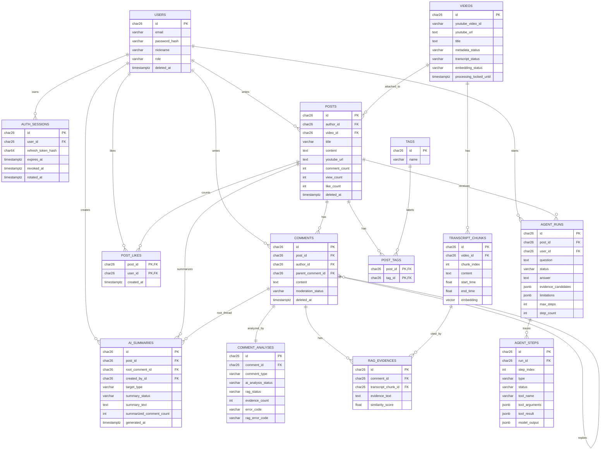

# ERD / 데이터 모델 문서

> 기준 코드: Phase 13 완료 backend entities와 migrations
> 목적: 발표, 인수인계, API 문서 확인에 필요한 핵심 관계와 저장 정책을 설명한다.

---

## 1. 핵심 ERD

---

## 2. ID / 시간 / 삭제 정책

- 주요 entity는 `BaseModel`을 상속하고 서버에서 ULID를 생성한다.
- primary key는 `char(26)`이다.
- `created_at`, `updated_at`, `deleted_at`은 `BaseModel`이 제공한다.
- 제품 정책상 soft delete가 중요한 대상은 `users`, `posts`, `comments`다.
- `post_tags`, `post_likes`는 복합 primary key를 가진 join/source table이며 `BaseModel`을 사용하지 않는다.
- `users`가 탈퇴해도 게시글/댓글은 유지하고 응답 author nickname은 `탈퇴한 회원`으로 표시한다.
- 댓글 삭제는 원문을 숨기고 `삭제된 댓글입니다` 또는 `관리자에 의해 삭제된 댓글입니다` placeholder로 표시한다.

---

## 3. 게시글 / 영상 / 태그

- `posts.video_id`는 `videos.id`를 참조한다.
- 같은 `youtube_video_id`는 하나의 `videos` row를 재사용한다.
- 게시글 생성은 video row를 만들거나 재사용한 뒤 바로 `201 Created`를 반환한다.
- 영상 metadata, transcript, embedding 처리는 서버 내부 비동기 작업으로 실행된다.
- `posts.comment_count`, `posts.view_count`, `posts.like_count`는 조회 성능용 파생 카운터다.
- 좋아요 원본은 `post_likes`이며 `(post_id, user_id)` 복합 primary key로 중복을 막는다.
- 태그 원본은 `tags`, 게시글-태그 관계는 `post_tags`다.

---

## 4. 댓글 / AI 분석 / RAG

- `comments.parent_comment_id`는 자기 참조 FK다.
- MVP 댓글 depth는 최대 2단계다. 대댓글의 대댓글은 API에서 막는다.
- 댓글 작성/수정 시 `comment_analyses` row를 `PENDING`으로 준비하고 AI 분석을 내부 비동기로 시도한다.
- AI 분석 실패는 댓글 작성/수정 실패가 아니며 `ai_analysis_status=FAILED`로 남는다.
- `FACT_CLAIM` 댓글에 대해서만 RAG 검색을 수행한다.
- 자막과 embedding이 준비되지 않았으면 `rag_status=PENDING`을 유지한다.
- `rag_evidences`는 댓글과 transcript chunk를 연결하고 `similarity_score`를 저장한다.
- RAG 검색은 pgvector cosine distance를 사용하고 similarity는 `1 - cosineDistance`로 계산한다.
- 현재 RAG 후보만 유지하므로 재분석/재처리 시 기존 evidence는 삭제 후 재생성한다.

---

## 5. Transcript / pgvector

- `transcript_chunks.video_id`는 `videos.id`를 참조한다.
- `(video_id, chunk_index)`는 unique index다.
- `embedding` column은 pgvector `vector(1536)` 타입이다.
- Docker 초기화 스크립트와 migration은 `CREATE EXTENSION IF NOT EXISTS vector;`를 전제로 한다.
- `EMBEDDING_DIMENSION` 기본값은 1536이며, embedding model 변경 시 DB column dimension과 함께 검토해야 한다.

---

## 6. MCP / Agent Trace

- `agent_runs`는 게시글 단위 사용자 질문, 상태, 최종 답변, 근거 후보, 한계를 저장한다.
- `agent_steps`는 run 내부의 model decision, tool call, tool result, final output trace를 저장한다.
- `(run_id, step_index)`는 unique index다.
- tool trace에는 API key, token, cookie, raw provider error, stack trace를 저장하지 않도록 service에서 sanitize한다.
- Agent는 domain service를 직접 우회하지 않고 MCP JSON-RPC tool boundary를 통해 도구를 호출한다.

---

## 7. Summary

- `ai_summaries`는 댓글 스레드 요약 row다.
- Phase 11/13 기준 `target_type`은 `COMMENT_THREAD`만 사용한다.
- `root_comment_id`에는 `deleted_at IS NULL` 조건의 partial unique index가 있어 active 요약은 루트 댓글 스레드당 1개만 유지한다.
- 생성 시 삭제되지 않은 루트 댓글과 직계 대댓글 수가 10개 이상이어야 한다.
- stale 여부는 저장된 `summarized_comment_count`, `last_comment_id`, `last_comment_updated_at`과 현재 active 댓글 상태를 비교해 조회 시 계산한다.
- stale 갱신은 기존 요약과 변경분 중심으로 provider 입력을 만든다.
