# 게시판 아키텍처 학습자료

## 1. 이 프로젝트를 한 문장으로 설명하기

이 게시판은 단순히 글과 댓글을 저장하는 커뮤니티가 아니라, 사용자가 올린 요리/재료 관련 게시글을 기반으로 AI가 추천과 글쓰기 보조를 제공하는 커뮤니티형 AI 게시판이다.

핵심은 다음 세 가지다.

- 사용자는 게시글, 댓글, 태그, 카테고리로 커뮤니티 활동을 한다.
- 백엔드는 인증, 게시판, 댓글, 사용자, AI 추천, 식재료 메타데이터 기능을 모듈별로 나누어 처리한다.
- AI 기능은 게시판 데이터를 RAG 문서로 바꾸고, 임베딩 검색을 통해 비슷한 게시글을 찾아 추천 근거로 활용한다.

## 2. 전체 아키텍처 그림

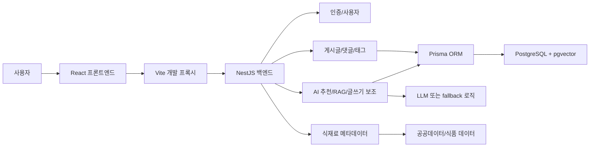

이 그림에서 가장 중요한 관계는 프론트엔드가 직접 데이터베이스와 대화하지 않는다는 점이다. 사용자의 모든 요청은 백엔드를 거치고, 백엔드는 서비스 계층을 통해 데이터베이스나 외부 AI 기능을 사용한다.

## 3. 계층별 역할

### 프론트엔드

프론트엔드는 사용자가 실제로 보는 화면과 상호작용을 담당한다.

주요 역할은 다음과 같다.

- 게시글 목록, 상세, 글쓰기, 검색, 태그, 마이페이지 화면 제공
- 로그인 상태 저장
- 사용자의 클릭, 입력, 페이지 이동 처리
- 백엔드 API 호출
- AI 추천 결과, 챗봇 답변, 글쓰기 보조 결과 표시

현재 구조의 특징은 여러 화면과 상태가 하나의 큰 앱 안에 집중되어 있다는 점이다. 기능이 작을 때는 빠르게 만들 수 있지만, 규모가 커지면 인증, 게시판, AI, 마이페이지처럼 관심사별로 분리하는 것이 유지보수에 유리하다.

### 백엔드

백엔드는 사용자의 요청을 실제 비즈니스 규칙에 맞게 처리한다.

주요 역할은 다음과 같다.

- 로그인/회원가입 처리
- JWT 기반 인증 확인
- 게시글 생성, 조회, 수정, 삭제
- 댓글 생성, 조회, 수정, 삭제
- 본인 글/댓글인지 권한 확인
- 태그와 카테고리 처리
- AI 추천 생성 및 저장
- 게시글을 RAG 검색용 문서로 변환
- 식재료 영양 메타데이터 조회

백엔드는 NestJS의 모듈 구조를 사용한다. 모듈은 기능별 묶음이라고 보면 된다. 예를 들어 게시글은 게시글 모듈, 댓글은 댓글 모듈, 인증은 인증 모듈이 담당한다.

### 데이터베이스

데이터베이스는 PostgreSQL을 사용한다. 일반 게시판 데이터뿐 아니라 AI 검색을 위한 벡터 데이터도 저장한다.

주요 데이터는 다음과 같다.

- 사용자
- 게시글
- 댓글
- 태그
- 게시글과 태그의 연결 정보
- 게시글 기반 RAG 문서
- AI 추천 결과
- AI 추천이 참고한 게시글
- 게시판 챗봇 대화 로그

특히 `pgvector`는 텍스트를 숫자 벡터로 바꾼 뒤 비슷한 의미의 문서를 찾기 위해 사용된다.

## 4. 핵심 도메인 모델 이해하기

### User

사용자 계정 정보를 의미한다.

생각할 포인트:

- 사용자는 게시글을 작성할 수 있다.
- 사용자는 댓글을 작성할 수 있다.
- 사용자는 AI 추천 요청 기록을 가질 수 있다.
- 비밀번호는 원문이 아니라 해시값으로 저장해야 한다.

### Post

게시판의 중심 데이터다.

게시글은 단순한 텍스트가 아니라 다음 정보와 연결된다.

- 작성자
- 댓글 목록
- 태그 목록
- 카테고리
- 조회수
- 이미지
- AI 추천 결과
- RAG 검색용 문서

이 프로젝트에서 게시글은 AI 기능의 근거 데이터로도 쓰인다. 그래서 글이 수정되면 기존 AI 추천이 오래된 상태가 될 수 있다.

### Comment

댓글은 특정 게시글에 종속된다.

중요한 특징:

- 댓글은 반드시 게시글에 연결된다.
- 게시글이 삭제되면 댓글도 함께 삭제된다.
- 댓글 수정/삭제는 작성자 본인만 가능하다.
- 댓글이 바뀌면 게시글의 AI 추천 근거도 달라질 수 있다.

### Tag

태그는 게시글을 분류하고 검색하기 위한 보조 정보다.

태그는 게시글과 다대다 관계를 가진다. 하나의 게시글은 여러 태그를 가질 수 있고, 하나의 태그는 여러 게시글에 붙을 수 있다.

### AI Recommendation

AI 추천 결과는 게시글 또는 사용자의 직접 입력을 바탕으로 만들어진다.

추천 결과에는 다음 정보가 포함된다.

- 추천 메뉴
- 추천 이유
- 사용할 수 있는 재료
- 부족한 재료
- 예상 조리 시간
- 난이도
- 조리 흐름
- 썸네일
- 영양 메타데이터
- 참고한 게시글

## 5. 주요 요청 흐름

### 게시글 목록 조회

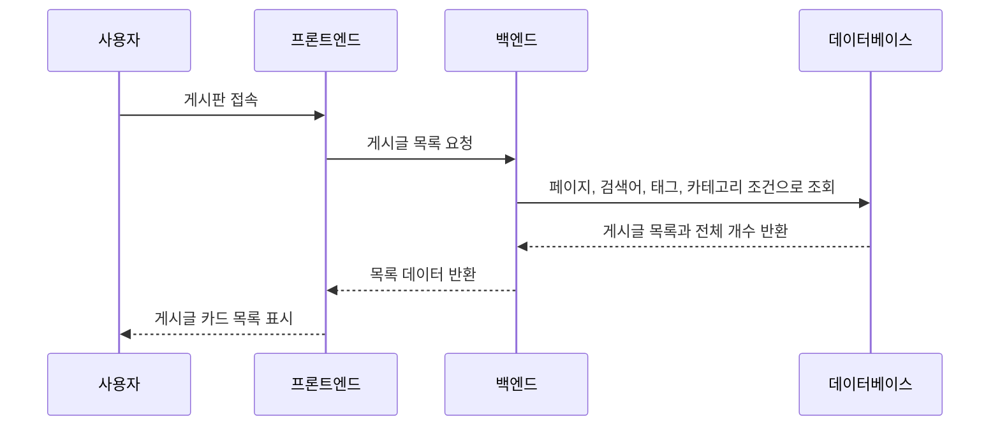

학습 포인트:

- 페이지네이션은 한 번에 모든 글을 가져오지 않기 위한 장치다.
- 검색어, 태그, 카테고리는 조회 조건이다.
- 목록 화면에서는 전체 본문보다 요약 정보가 중요하다.

### 게시글 상세 조회

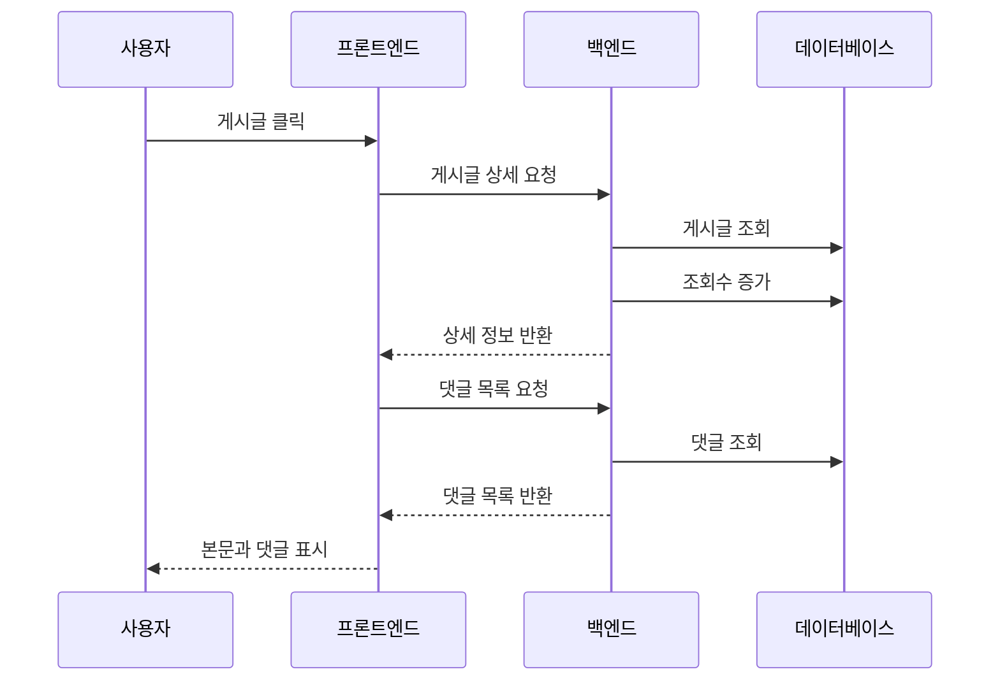

학습 포인트:

- 상세 조회는 단순 읽기처럼 보이지만 조회수 증가라는 쓰기 동작도 포함한다.
- 게시글과 댓글은 분리해서 불러올 수 있다.
- 사용자는 하나의 화면을 보지만 내부적으로는 여러 요청이 오갈 수 있다.

### 게시글 작성

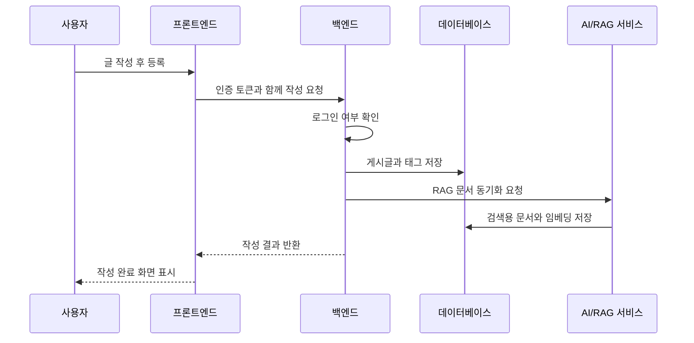

학습 포인트:

- 글 작성은 인증이 필요한 기능이다.
- 게시글 저장 이후 AI 검색을 위한 별도 준비 작업이 이어진다.
- 사용자 입장에서는 글 하나를 쓴 것이지만 시스템 입장에서는 커뮤니티 데이터와 AI 검색 데이터가 함께 갱신된다.

### 댓글 작성

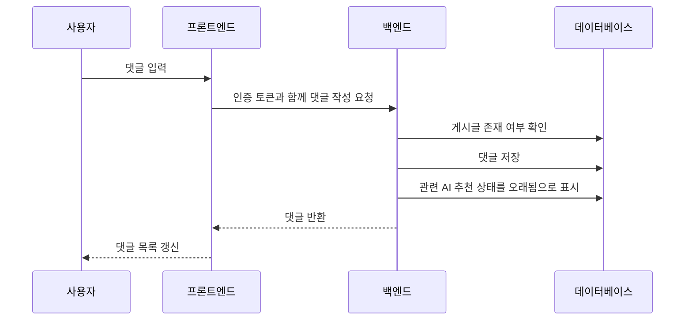

학습 포인트:

- 댓글은 게시글이 존재할 때만 작성 가능하다.
- 댓글도 게시글의 맥락을 바꾸기 때문에 AI 추천 상태에 영향을 줄 수 있다.

## 6. 인증과 권한

이 프로젝트는 JWT 기반 인증을 사용한다.

기본 흐름은 다음과 같다.

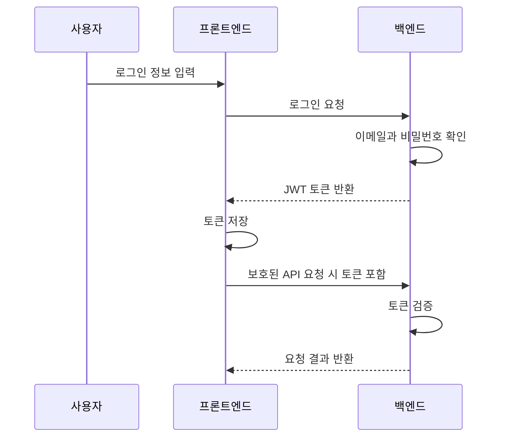

JWT를 이해할 때 중요한 것은 “로그인했다”는 상태를 서버 세션이 아니라 토큰으로 증명한다는 점이다.

권한 규칙도 중요하다.

- 글 작성은 로그인 사용자가 가능하다.
- 글 수정/삭제는 작성자 본인만 가능하다.
- 댓글 작성은 로그인 사용자가 가능하다.
- 댓글 수정/삭제는 작성자 본인만 가능하다.

발표할 때는 인증과 권한을 구분해서 설명하는 것이 좋다.

- 인증: 너는 누구인가?
- 권한: 네가 이 행동을 해도 되는가?

## 7. RAG와 AI 추천 구조

### RAG란?

RAG는 Retrieval-Augmented Generation의 약자다. 한국어로 풀면 “검색으로 근거를 찾고, 그 근거를 바탕으로 답변을 생성하는 방식”이다.

일반 AI 답변은 모델이 알고 있는 지식에만 의존할 수 있다. 반면 RAG는 우리 게시판에 실제로 쌓인 글을 먼저 검색하고, 그 결과를 참고해서 답변한다.

이 프로젝트에서 RAG가 필요한 이유:

- 게시판에 쌓인 실제 사용자 경험을 추천 근거로 활용할 수 있다.
- 비슷한 재료나 상황의 글을 찾아 더 맥락 있는 추천을 만들 수 있다.
- AI가 임의로 말하는 느낌을 줄이고, 커뮤니티 데이터에 기반한 답변을 만들 수 있다.

### 임베딩이란?

임베딩은 텍스트를 숫자 배열로 바꾸는 과정이다.

예를 들어 “김치, 계란, 찬밥으로 뭐 해먹지?”라는 문장을 숫자 벡터로 바꿔 저장하면, 나중에 “김치볶음밥”, “계란밥”, “남은 밥 요리” 같은 의미적으로 가까운 글을 찾을 수 있다.

중요한 점은 단순히 같은 단어가 있는지를 보는 것이 아니라 의미적으로 가까운지를 비교한다는 것이다.

### pgvector의 역할

PostgreSQL은 원래 관계형 데이터베이스다. 여기에 `pgvector`를 사용하면 벡터 데이터를 저장하고 유사도 검색을 할 수 있다.

이 프로젝트에서는 게시글을 RAG 문서로 만들고, 해당 문서의 임베딩을 저장해둔다. 이후 사용자의 질문이나 재료 입력이 들어오면 그 입력도 임베딩으로 바꾸고, 기존 게시글 임베딩과 가까운 것을 찾는다.

### AI 추천 흐름

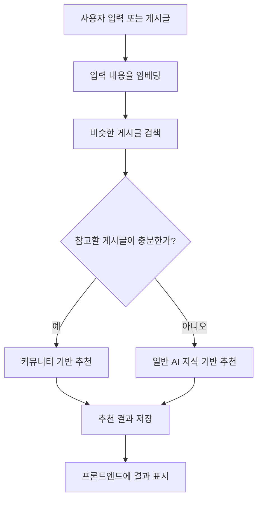

발표에서 강조하면 좋은 점:

- AI 추천은 게시판 데이터를 단순 장식으로 쓰는 것이 아니라 실제 추천 근거로 사용한다.
- 게시글이 쌓일수록 추천 품질이 좋아질 가능성이 있다.
- 데이터가 부족한 경우에도 fallback을 두어 사용자가 빈 결과를 받지 않게 한다.

## 8. 글쓰기 보조 에이전트

글쓰기 보조는 사용자가 더 좋은 질문이나 공유글을 작성하도록 돕는 기능이다.

흐름은 다음과 같다.

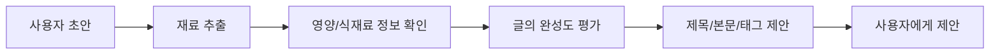

이 기능의 핵심은 AI가 글을 대신 쓰는 것이 아니라, 커뮤니티에서 더 답변받기 쉬운 글로 정리해주는 것이다.

예를 들어 좋은 게시글은 보통 다음 정보를 포함한다.

- 가지고 있는 재료
- 원하는 요리 방향
- 조리 시간
- 피하고 싶은 재료나 조건
- 이미 시도해본 방법
- 구체적인 질문

## 9. 식재료 메타데이터 기능

식재료 메타데이터 기능은 재료 이름을 바탕으로 영양 정보를 찾는 역할을 한다.

이 기능은 AI 추천과 글쓰기 보조에 보조 근거를 제공한다.

예를 들어 사용자가 “닭가슴살, 계란, 두부”를 입력하면 단백질 중심 재료라는 판단에 도움을 줄 수 있다. 반대로 나트륨이 높은 재료가 포함되어 있으면 저염 목표와 충돌할 수 있다.

주의할 점은 영양 정보가 항상 정확하게 매칭되는 것은 아니라는 것이다. 실제 서비스에서는 매칭 실패, 비슷한 후보, 외부 API 오류, 호출 제한 같은 상황을 고려해야 한다.

## 10. 이 아키텍처의 장점

### 기능별 모듈화

백엔드가 인증, 게시글, 댓글, 사용자, AI, 식재료 메타데이터로 나뉘어 있어 역할을 이해하기 쉽다.

팀 프로젝트에서 장점:

- 팀원별로 맡을 기능을 나누기 쉽다.
- 특정 기능을 수정할 때 영향 범위를 파악하기 쉽다.
- 테스트를 기능 단위로 작성하기 좋다.

### AI 기능과 게시판 기능의 결합

AI가 별도의 장식 기능이 아니라 게시판 데이터와 연결되어 있다.

장점:

- 게시글이 많아질수록 추천 근거가 풍부해진다.
- 사용자는 커뮤니티 글과 AI 추천을 함께 활용할 수 있다.
- AI 추천 결과가 다시 게시판 활동으로 이어질 수 있다.

### RAG 기반 확장성

단순 검색보다 의미 기반 검색이 가능하다.

예를 들어 “남은 족발”, “고기 남았을 때”, “상추랑 쌈장 처리”처럼 표현이 달라도 비슷한 상황을 찾을 수 있다.

## 11. 현재 구조에서 고민해볼 점

### 프론트엔드 관심사 분리

현재 프론트엔드는 여러 화면과 상태가 한곳에 많이 모여 있는 구조다.

프로젝트가 커질수록 다음 기준으로 나눌 수 있다.

- 인증 관련 상태
- 게시판 목록/상세 상태
- 글쓰기 상태
- AI 추천 상태
- 마이페이지 상태
- API 호출 함수

이것은 지금 당장 틀렸다는 뜻이 아니라, 프로젝트가 커질 때 자연스럽게 생기는 다음 단계다.

### AI 추천 최신성 관리

게시글이나 댓글이 바뀌면 기존 추천이 오래된 정보가 될 수 있다. 이 프로젝트는 그런 경우 추천 상태를 오래됨으로 표시하는 방향을 가진다.

생각해볼 질문:

- 댓글 하나가 추가될 때마다 추천을 오래됨으로 표시하는 것이 항상 맞을까?
- 글 본문이 바뀐 경우와 댓글이 바뀐 경우를 같은 강도로 봐야 할까?
- 추천을 자동으로 재생성할지, 사용자가 직접 다시 요청하게 할지?

### 데이터가 부족할 때의 AI 품질

RAG는 참고할 데이터가 있을 때 강력하다. 하지만 초기 서비스처럼 게시글이 적으면 검색 결과가 부족할 수 있다.

이 프로젝트는 일반 AI 지식 기반 fallback을 둔다.

생각해볼 질문:

- fallback 답변이라는 사실을 사용자에게 얼마나 명확히 보여줘야 할까?
- 커뮤니티 기반 추천과 일반 AI 추천의 신뢰도를 다르게 보여줄 필요가 있을까?

## 12. 발표 구성 추천

발표는 다음 순서로 하면 이해가 쉽다.

### 1단계: 문제 정의

우리가 만든 것은 일반 게시판이 아니라 요리와 냉장고 재료 고민을 해결하는 커뮤니티형 AI 게시판이다.

발표 멘트 예시:

“사용자가 재료 고민을 게시글로 남기고, 다른 사용자의 경험과 AI 추천을 함께 활용할 수 있도록 설계했습니다.”

### 2단계: 전체 구조

프론트엔드, 백엔드, 데이터베이스, AI/RAG의 관계를 설명한다.

발표 멘트 예시:

“사용자 화면은 React가 담당하고, 실제 데이터 처리와 권한 검사는 NestJS 백엔드가 담당합니다. 데이터는 PostgreSQL에 저장하고, 의미 기반 검색을 위해 pgvector를 함께 사용했습니다.”

### 3단계: 게시판 기본 흐름

목록, 상세, 작성, 댓글, 검색, 태그 흐름을 설명한다.

발표 멘트 예시:

“게시글은 카테고리와 태그를 통해 분류되고, 댓글과 조회수 정보를 함께 가집니다. 작성과 수정, 삭제는 JWT 인증을 통해 본인 여부를 확인합니다.”

### 4단계: AI 기능

RAG, 임베딩, 추천, 챗봇, 글쓰기 보조를 설명한다.

발표 멘트 예시:

“AI 추천은 단순히 모델에게 질문하는 방식이 아니라, 기존 게시판 글을 임베딩해두고 비슷한 글을 찾아 추천 근거로 사용하는 RAG 구조입니다.”

### 5단계: 확장 가능성과 개선점

현재 구조의 장점과 앞으로의 개선 방향을 말한다.

발표 멘트 예시:

“현재는 기능 구현 중심으로 프론트 상태가 한곳에 많이 모여 있지만, 서비스가 커지면 인증, 게시판, AI 추천 단위로 상태와 API 호출을 분리할 수 있습니다.”

## 13. 발표 예상 질문과 답변

### Q1. 왜 일반 검색이 아니라 RAG를 사용했나요?

일반 검색은 주로 단어 일치에 의존한다. 하지만 사용자는 같은 상황을 다양한 표현으로 말할 수 있다. RAG와 임베딩 검색을 사용하면 표현이 달라도 의미가 비슷한 게시글을 찾을 수 있고, 그 결과를 AI 추천의 근거로 사용할 수 있다.

### Q2. pgvector는 왜 필요한가요?

게시글이나 사용자 입력을 임베딩하면 숫자 벡터가 된다. pgvector는 PostgreSQL 안에서 이 벡터를 저장하고 유사도를 비교할 수 있게 해준다. 그래서 별도의 벡터 DB 없이도 의미 기반 검색을 구현할 수 있다.

### Q3. JWT 인증을 쓰는 이유는 무엇인가요?

JWT는 로그인한 사용자를 토큰으로 식별하는 방식이다. 프론트엔드는 로그인 후 받은 토큰을 저장하고, 보호된 요청을 보낼 때 함께 전달한다. 백엔드는 토큰을 검증해서 사용자가 누구인지 확인한다.

### Q4. 글이나 댓글이 수정되면 AI 추천은 어떻게 되나요?

글이나 댓글이 바뀌면 기존 추천의 근거가 달라질 수 있다. 그래서 해당 게시글과 연결된 RAG 문서나 AI 추천 상태를 오래된 상태로 표시한다. 이렇게 하면 사용자가 이전 추천이 현재 글 내용과 다를 수 있다는 점을 알 수 있다.

### Q5. AI 추천이 항상 게시판 글을 참고하나요?

항상 그런 것은 아니다. 참고할 만한 게시글이 충분하면 커뮤니티 기반 추천을 만들고, 데이터가 부족하면 일반 AI 지식 기반 추천으로 fallback한다. 이 구조 덕분에 초기 데이터가 부족해도 사용자는 답변을 받을 수 있다.

### Q6. 이 구조의 가장 큰 장점은 무엇인가요?

게시판 데이터가 쌓일수록 AI 추천의 근거가 풍부해진다는 점이다. 단순 게시판은 글이 쌓이는 것으로 끝나지만, 이 구조에서는 글이 AI 추천 품질을 높이는 자산이 된다.

### Q7. 가장 개선하고 싶은 부분은 무엇인가요?

프론트엔드 상태와 화면 로직을 기능별로 나누는 것이 좋다. 현재는 여러 화면과 API 호출이 한 앱에 많이 모여 있어 기능이 늘어날수록 복잡도가 올라갈 수 있다. 추후에는 게시판, 인증, AI 추천, 마이페이지 단위로 분리하면 유지보수가 쉬워진다.

## 14. 팀원별 학습 분담 추천

팀 발표를 준비한다면 다음처럼 나누면 좋다.

### 팀원 A: 전체 아키텍처

학습 범위:

- 프론트엔드, 백엔드, 데이터베이스의 역할
- 요청과 응답 흐름
- 모듈 구조의 장점

발표 목표:

- “이 서비스가 어떤 큰 구조로 동작하는지” 설명할 수 있어야 한다.

### 팀원 B: 게시판 도메인

학습 범위:

- User, Post, Comment, Tag 관계
- 게시글 목록/상세/작성/수정/삭제 흐름
- 댓글 권한 처리

발표 목표:

- “게시판 기본 기능이 어떻게 데이터 모델과 연결되는지” 설명할 수 있어야 한다.

### 팀원 C: 인증과 권한

학습 범위:

- JWT 개념
- 로그인 흐름
- 인증과 권한의 차이
- 본인 글/댓글만 수정 삭제 가능한 이유

발표 목표:

- “로그인한 사용자를 어떻게 식별하고 보호된 기능을 제어하는지” 설명할 수 있어야 한다.

### 팀원 D: AI/RAG

학습 범위:

- RAG 개념
- 임베딩 개념
- pgvector 역할
- 커뮤니티 기반 추천과 fallback 구조

발표 목표:

- “AI가 게시판 데이터를 어떻게 추천 근거로 사용하는지” 설명할 수 있어야 한다.

### 팀원 E: 개선점과 확장성

학습 범위:

- 프론트엔드 관심사 분리
- AI 추천 최신성 관리
- 데이터 부족 시 fallback
- 서비스 확장 시 고려할 점

발표 목표:

- “현재 구조의 장점과 한계, 앞으로의 개선 방향”을 설명할 수 있어야 한다.

## 15. 발표 전 체크리스트

- 전체 구조를 그림 없이 말로 설명할 수 있는가?
- 프론트엔드와 백엔드의 역할 차이를 설명할 수 있는가?
- 게시글, 댓글, 태그의 관계를 설명할 수 있는가?
- 인증과 권한의 차이를 설명할 수 있는가?
- RAG와 임베딩을 비전공자에게 설명할 수 있는가?
- pgvector가 왜 필요한지 설명할 수 있는가?
- 게시글 수정이 AI 추천 상태에 영향을 주는 이유를 설명할 수 있는가?
- 현재 구조의 개선 방향을 하나 이상 말할 수 있는가?

## 16. 비전공자에게 설명하는 버전

이 게시판은 요리 고민을 올리는 커뮤니티다. 사용자가 “냉장고에 이런 재료가 있는데 뭘 만들까?”라고 글을 쓰면, 다른 사람의 댓글뿐 아니라 AI도 도움을 줄 수 있다.

AI는 아무 근거 없이 답하는 것이 아니라, 기존 게시판에 올라온 비슷한 글을 먼저 찾아본다. 예를 들어 예전에 누군가 “김치, 계란, 찬밥”으로 요리한 글이 있다면, 새 사용자가 비슷한 고민을 올렸을 때 그 글을 참고해서 추천해준다.

그래서 이 서비스는 글이 쌓일수록 더 똑똑해질 수 있다. 게시판의 데이터가 곧 AI 추천의 재료가 되기 때문이다.

## 17. 공부할 때 꼭 잡아야 할 개념

### API

프론트엔드와 백엔드가 대화하는 약속이다. 사용자가 버튼을 누르면 프론트엔드는 API를 통해 백엔드에 요청을 보낸다.

### ORM

데이터베이스를 직접 다루기보다 객체나 메서드처럼 다룰 수 있게 도와주는 도구다. 이 프로젝트에서는 Prisma가 그 역할을 한다.

### 관계형 데이터

사용자, 게시글, 댓글처럼 서로 연결된 데이터를 테이블로 표현하는 방식이다.

### 인증

사용자가 누구인지 확인하는 과정이다.

### 권한

확인된 사용자가 특정 행동을 해도 되는지 판단하는 과정이다.

### RAG

AI가 답변하기 전에 관련 자료를 먼저 검색하고, 그 자료를 근거로 답변하는 방식이다.

### 임베딩

문장의 의미를 숫자 벡터로 바꾸는 기술이다.

### 벡터 검색

숫자로 바뀐 문장들 사이의 의미적 거리를 비교해서 비슷한 자료를 찾는 방식이다.

## 18. 마무리 발표 멘트

“이 프로젝트의 핵심은 게시판 기능과 AI 기능이 따로 존재하는 것이 아니라 서로 연결되어 있다는 점입니다. 사용자가 작성한 글은 커뮤니티 활동의 결과물이면서 동시에 AI 추천의 근거 데이터가 됩니다. 그래서 게시글이 많아질수록 서비스의 추천 품질도 함께 발전할 수 있는 구조입니다.”

## 19. RAG 심화 학습자료

### RAG를 왜 쓰는가?

AI에게 바로 질문하면 답변은 만들 수 있다. 하지만 그 답변이 우리 서비스의 실제 게시글, 댓글, 사용자 경험을 반영한다고 보장하기 어렵다.

RAG는 이 문제를 해결하기 위한 구조다.

RAG의 핵심은 다음 순서다.

- 먼저 관련 자료를 찾는다.
- 찾은 자료를 AI에게 근거로 제공한다.
- AI는 그 근거를 바탕으로 답변을 생성한다.

이 프로젝트에서는 “관련 자료”가 게시판 글과 댓글이다. 즉, AI 추천의 근거가 외부의 막연한 지식이 아니라 우리 커뮤니티 안에 쌓인 경험이 된다.

### 일반 검색과 RAG 검색의 차이

일반 검색은 주로 단어가 일치하는지를 본다.

예를 들어 사용자가 “찬밥이랑 김치로 뭐하지?”라고 입력했을 때, 일반 검색은 “찬밥”, “김치”라는 단어가 들어간 글을 찾는 데 강하다.

하지만 의미 기반 검색은 표현이 조금 달라도 비슷한 상황을 찾을 수 있다.

예를 들어 다음 표현들은 단어가 완전히 같지 않아도 비슷한 고민이다.

- “찬밥 처리하고 싶어요”
- “남은 밥으로 간단한 요리 추천”
- “김치랑 계란밖에 없을 때”
- “냉장고 털이 볶음밥”

RAG는 이런 의미적 연결을 활용해 더 맥락 있는 답변을 만들 수 있다.

### RAG의 4단계

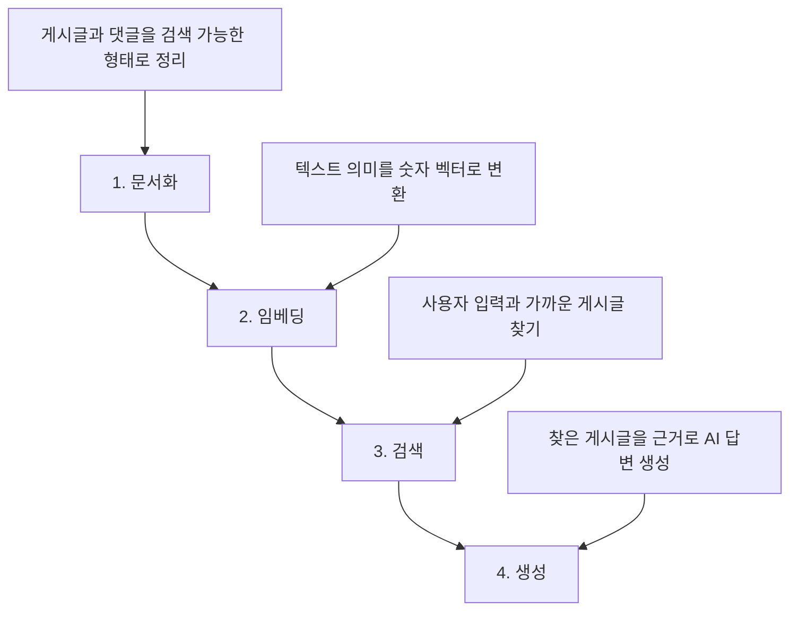

### 1단계: 문서화

게시글 원문을 그대로 검색에 쓰는 것보다, 검색하기 좋은 형태로 정리하는 과정이 필요하다.

이 프로젝트에서는 게시글에서 다음과 같은 정보를 RAG 문서로 정리한다.

- 제목
- 작성자
- 요약
- 재료
- 음식 이름
- 조리 방식
- 상황 태그
- 난이도
- 조리 시간
- 검색용 텍스트

이렇게 정리하면 AI가 단순히 긴 글을 읽는 것이 아니라, 추천에 필요한 신호를 더 잘 활용할 수 있다.

### 2단계: 임베딩

임베딩은 텍스트의 의미를 숫자 배열로 바꾸는 것이다.

사람은 “김치볶음밥”과 “남은 밥으로 만드는 매콤한 한 끼”가 비슷하다는 것을 감으로 안다. 컴퓨터는 이 감을 직접 이해하지 못하므로, 문장의 의미를 숫자로 바꿔 비교한다.

발표에서는 이렇게 설명하면 좋다.

“임베딩은 문장의 의미를 좌표처럼 바꾸는 과정입니다. 의미가 비슷한 문장들은 숫자 공간에서도 가까운 위치에 놓입니다.”

### 3단계: 유사도 검색

사용자의 질문도 임베딩으로 바꾸고, 기존 게시글 임베딩과 거리를 비교한다.

가까운 글일수록 지금 사용자의 고민과 비슷한 글이라고 볼 수 있다.

이 프로젝트에서는 PostgreSQL에 pgvector를 붙여 벡터 검색을 수행한다.

### 4단계: 생성

검색된 게시글은 AI에게 근거 자료로 전달된다. AI는 이 자료를 참고해 추천 메뉴, 이유, 부족한 재료, 조리 흐름 등을 생성한다.

여기서 중요한 점은 AI가 검색 결과를 그대로 복사하는 것이 아니라, 검색 결과를 바탕으로 새 답변을 구성한다는 것이다.

### RAG의 장점

RAG의 장점은 다음과 같다.

- 우리 서비스에 쌓인 데이터를 AI가 활용할 수 있다.
- 최신 게시글이나 댓글을 추천 근거로 반영할 수 있다.
- 단순 키워드 검색보다 의미적으로 가까운 자료를 찾을 수 있다.
- AI 답변의 근거를 사용자에게 보여줄 수 있다.
- 게시글이 쌓일수록 추천 품질이 좋아질 가능성이 있다.

### RAG의 한계

RAG가 만능은 아니다.

한계도 분명하다.

- 검색된 근거가 부정확하면 답변도 흔들릴 수 있다.
- 게시글 데이터가 부족하면 좋은 근거를 찾기 어렵다.
- 비슷한 글을 찾았다고 해서 항상 정답은 아니다.
- 오래된 글이나 잘못된 댓글이 근거로 사용될 수 있다.
- AI가 근거보다 더 강하게 추측해버릴 위험이 있다.

그래서 RAG 시스템에서는 “무엇을 검색할지”, “검색 결과를 얼마나 신뢰할지”, “사용자에게 근거를 어떻게 보여줄지”가 중요하다.

### 이 프로젝트에서 RAG가 쓰이는 곳

이 프로젝트에서 RAG는 크게 두 곳에서 쓰인다.

### AI 추천

사용자가 특정 게시글에서 AI 추천을 요청하거나 직접 재료를 입력하면, 비슷한 게시판 글을 찾고 그 글들을 참고해 요리 추천을 만든다.

결과는 두 가지 유형으로 나뉜다.

- `COMMUNITY_RAG`: 비슷한 커뮤니티 게시글을 근거로 한 추천
- `GENERAL_AI`: 참고할 게시글이 부족해서 일반 AI 지식으로 만든 추천

이 구분은 발표에서 중요하다. AI가 언제 커뮤니티 근거를 사용했고, 언제 일반 지식으로 fallback했는지 보여주기 때문이다.

### 게시판 챗봇

게시판 챗봇은 사용자의 짧은 재료 입력을 받아 관련 게시글을 찾고, 그 결과를 바탕으로 답변한다.

예를 들어 사용자가 “족발, 상추, 찬밥 있어”라고 말하면, 시스템은 비슷한 재료나 상황이 담긴 글을 찾고, 참고 글과 함께 답변을 제공한다.

### RAG 발표 멘트 예시

“RAG는 AI가 바로 답변하게 만드는 방식이 아니라, 먼저 우리 게시판에서 비슷한 글을 찾고 그 글을 근거로 답변하게 만드는 구조입니다. 그래서 사용자가 쓴 글이 단순 저장 데이터로 끝나는 것이 아니라, 다음 사용자에게 추천 근거로 재사용됩니다.”

## 20. MCP 심화 학습자료

### MCP란?

MCP는 Model Context Protocol의 약자다.

쉽게 말하면 AI나 에이전트가 외부 도구와 데이터를 일정한 방식으로 사용할 수 있게 해주는 연결 규칙이다.

비유하면 다음과 같다.

- AI는 판단하고 문장을 만드는 두뇌에 가깝다.
- MCP 도구는 계산기, 사전, 검색 도구, 데이터 조회 도구에 가깝다.
- MCP는 두뇌와 도구가 대화하는 공통 약속이다.

즉, MCP는 AI 자체가 아니라 AI가 사용할 수 있는 도구 연결 방식이다.

### 왜 MCP가 필요한가?

AI 모델은 모든 최신 데이터나 서비스 내부 데이터를 직접 알고 있지 않다. 또한 정확한 영양성분, 재고, 일정, 문서, 데이터베이스 같은 정보는 모델이 추측하면 안 된다.

이럴 때 MCP가 필요하다.

MCP를 사용하면 AI는 필요한 순간 외부 도구를 호출해서 사실 정보를 가져올 수 있다.

예를 들어 이 프로젝트에서는 식재료 영양 정보를 AI가 추측하지 않고, 식품 메타데이터 도구에서 가져오게 한다.

### 이 프로젝트에서 MCP의 역할

이 프로젝트의 MCP는 “한국 식재료 영양 메타데이터 제공자” 역할이다.

중요한 점은 MCP가 최종 요리를 추천하는 주체가 아니라는 것이다.

MCP가 하는 일:

- 식재료 이름 정규화
- 식품 후보 검색
- 영양성분 조회
- 여러 재료의 영양 정보 요약
- 데이터 없음, API 오류, 설정 누락 같은 상태 보고

MCP가 하지 않는 일:

- 최종 메뉴 선택
- 조리법 생성
- 커뮤니티 근거 판단
- 게시글과 댓글 기반 추천 결정
- 의학적 판단

이 책임 경계가 중요하다. MCP는 사실 정보 도구이고, RAG는 커뮤니티 근거 검색이며, AI 추천 서비스는 이 둘을 조합해 사용자에게 답변을 만든다.

### MCP와 RAG의 차이

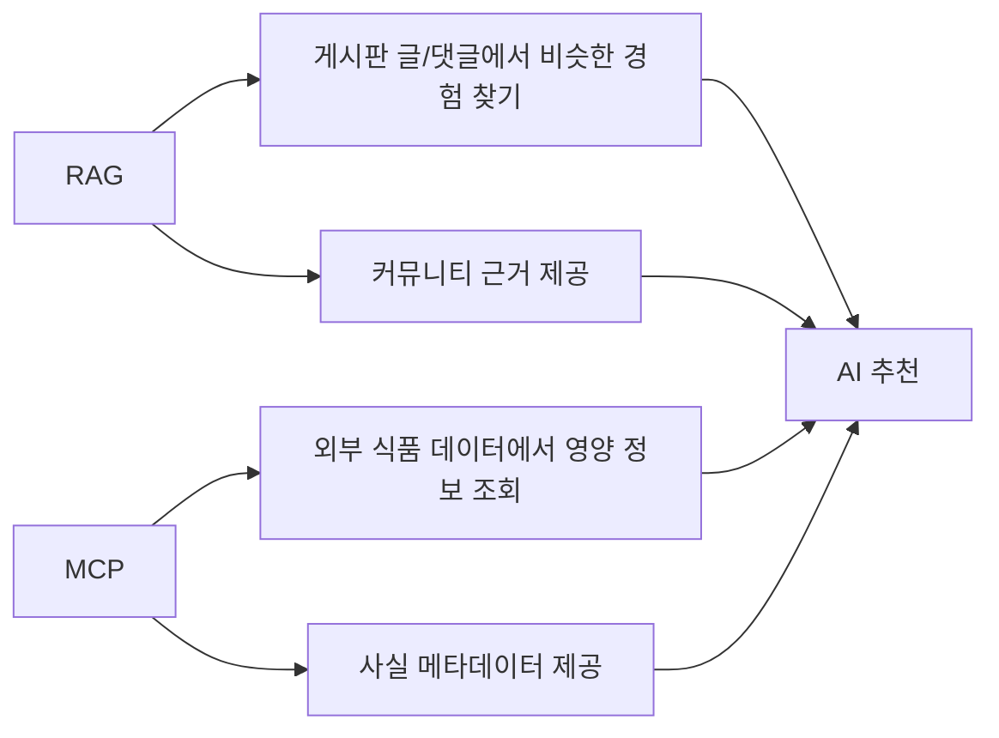

RAG와 MCP는 둘 다 AI 답변을 더 믿을 수 있게 만들지만, 역할이 다르다.

RAG는 “우리 커뮤니티 안에서 비슷한 경험을 찾는 기능”이다.

MCP는 “외부 도구나 데이터에서 정확한 사실 정보를 가져오는 기능”이다.

### 비교 표

| 구분 | RAG | MCP |
| --- | --- | --- |
| 핵심 질문 | 비슷한 게시글이 있는가? | 이 재료의 사실 정보는 무엇인가? |
| 데이터 출처 | 게시판 글, 댓글, RAG 문서 | 공공데이터/식품 메타데이터 |
| 주요 기술 | 임베딩, 벡터 검색, pgvector | 도구 호출, 표준화된 입력/출력 |
| 결과 | 참고 게시글, 유사도, 추천 근거 | 영양성분, 후보 식품, 매칭 상태 |
| 책임 | 커뮤니티 맥락 제공 | 사실 정보 제공 |
| 주의점 | 근거 글 품질에 영향받음 | 외부 API 오류/매칭 실패 가능 |

### MCP 흐름

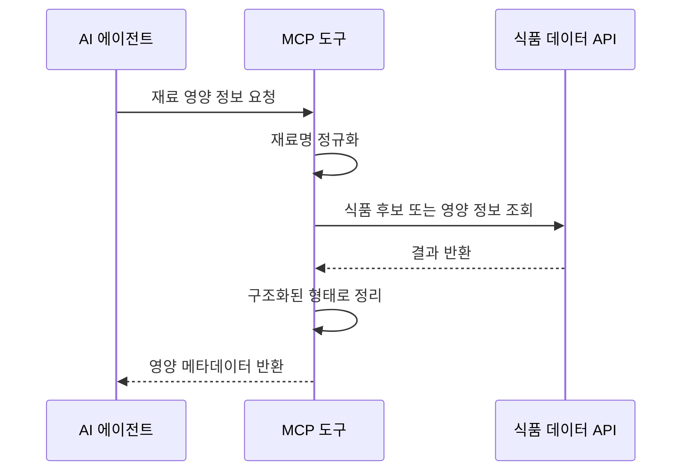

이 흐름에서 핵심은 MCP가 결과를 “구조화된 데이터”로 돌려준다는 점이다. 그냥 문장으로 “아마 단백질이 많을 거예요”라고 말하는 것이 아니라, 재료별 영양성분, 매칭 상태, 데이터 출처를 구분해서 제공한다.

### 이 프로젝트의 MCP 도구 예시

이 프로젝트의 식재료 MCP는 개념적으로 다음 도구들을 제공한다.

### 식품 후보 검색

사용자가 입력한 음식 이름으로 식품 후보를 찾는다.

예를 들어 “계란”을 입력하면 계란과 관련된 식품 후보들이 나올 수 있다.

### 단일 식품 영양 조회

특정 재료 하나에 대한 영양 정보를 가져온다.

예를 들어 “두부”를 입력하면 열량, 탄수화물, 단백질, 지방, 당류, 나트륨 같은 정보를 확인할 수 있다.

### 여러 재료 영양 요약

여러 재료를 한 번에 분석해 재료별 정보와 간단한 합계/평균을 제공한다.

다만 여기서 주의할 점이 있다. 재료의 실제 중량을 모르면 최종 요리 전체의 정확한 영양성분이라고 말할 수 없다. 그래서 이 정보는 “참고 메타데이터”로 봐야 한다.

### MCP의 실패 상황

MCP는 외부 데이터를 다루기 때문에 실패 가능성을 고려해야 한다.

대표적인 실패 상황:

- API 키가 설정되지 않음
- 외부 API 응답 실패
- 호출 제한
- 검색 결과 없음
- 비슷한 후보는 있지만 정확한 매칭은 아님
- 데이터 형식이 예상과 다름

좋은 MCP 도구는 실패했을 때도 그냥 멈추지 않고, 실패 상태를 구조적으로 알려준다.

예를 들어 다음과 같은 상태를 구분할 수 있다.

- 설정 누락
- 검색 결과 없음
- 후보 있음
- 정상 매칭
- API 오류
- 호출 제한

이렇게 해야 AI나 프론트엔드가 사용자에게 적절한 메시지를 보여줄 수 있다.

### MCP와 보안

MCP는 외부 API 키나 내부 데이터에 접근할 수 있으므로 보안이 중요하다.

이 프로젝트에서 중요한 원칙은 다음과 같다.

- 공공데이터 API 키는 프론트엔드에 노출하지 않는다.
- 외부 API 호출은 백엔드나 MCP 서버 쪽에서 처리한다.
- 사용자가 보는 화면에는 필요한 결과만 전달한다.
- 오류가 나도 API 키 같은 민감 정보는 출력하지 않는다.

발표에서는 이렇게 말하면 좋다.

“MCP는 외부 데이터를 연결하는 역할을 하기 때문에 API 키와 민감 정보는 반드시 서버 쪽에서 관리해야 합니다.”

## 21. RAG와 MCP를 함께 쓰는 이유

RAG와 MCP는 서로 경쟁하는 기술이 아니라 보완 관계다.

요리 추천을 예로 들면 다음과 같다.

RAG가 답하는 질문:

- 비슷한 상황에서 다른 사용자는 뭘 만들었는가?
- 이 재료 조합과 비슷한 게시글이 있는가?
- 커뮤니티에서 실제로 나온 경험은 무엇인가?

MCP가 답하는 질문:

- 이 재료의 영양성분은 무엇인가?
- 단백질이 많은 재료가 포함되어 있는가?
- 나트륨이 높은 재료가 있는가?
- 식재료 이름이 공공데이터에서 어떻게 매칭되는가?

AI 추천 서비스는 이 둘을 합쳐 더 나은 답변을 만든다.

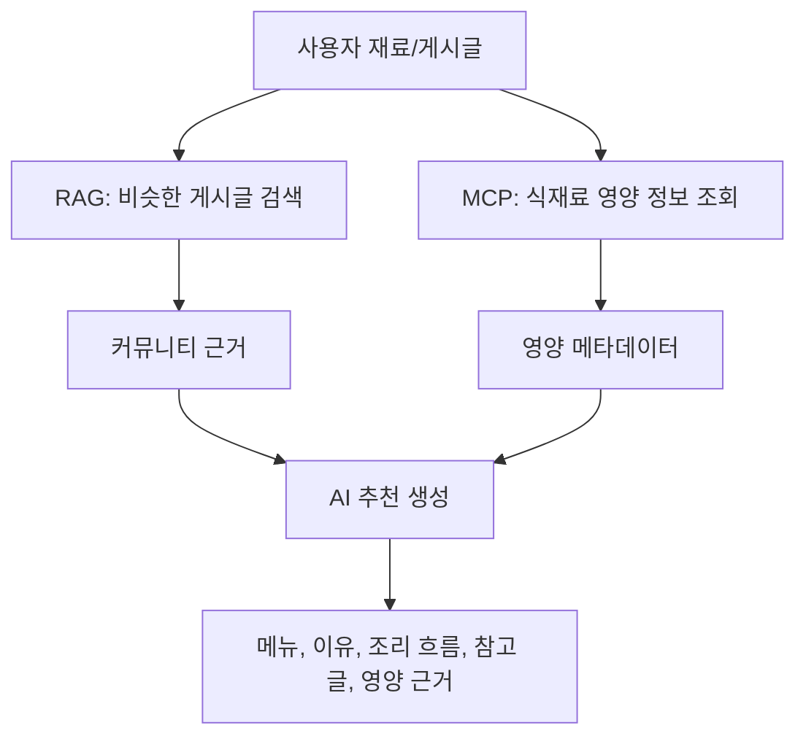

이 구조의 장점은 추천의 근거가 두 겹이 된다는 점이다.

- 커뮤니티 근거: 실제 게시글과 댓글
- 사실 근거: 식재료 영양 메타데이터

그래서 AI 답변이 단순히 그럴듯한 문장이 아니라, 사용자 경험과 외부 데이터에 기반한 답변에 가까워진다.

## 22. RAG/MCP 발표 예상 질문

### Q1. RAG와 MCP는 같은 건가요?

아니다. RAG는 관련 문서를 검색해서 AI 답변의 근거로 쓰는 방식이고, MCP는 AI가 외부 도구나 데이터와 연결되는 표준화된 방법이다. 이 프로젝트에서는 RAG가 게시판 글을 찾고, MCP는 식재료 영양 정보를 제공한다.

### Q2. 왜 MCP가 직접 요리를 추천하지 않나요?

MCP의 역할은 사실 정보를 제공하는 것이다. 식재료 영양 정보는 추천에 참고할 수 있지만, 최종 메뉴 선택은 게시글 맥락, 사용자 요청, RAG 근거, AI 생성 로직이 함께 판단해야 한다. 역할을 분리해야 시스템을 더 신뢰할 수 있다.

### Q3. RAG만 있으면 MCP는 필요 없지 않나요?

RAG는 커뮤니티 경험을 찾는 데 강하지만, 정확한 영양성분 같은 외부 사실 정보에는 한계가 있다. MCP는 이런 사실 정보를 보완한다. 즉, RAG는 “비슷한 경험”, MCP는 “검증 가능한 식재료 정보”를 담당한다.

### Q4. MCP만 있으면 RAG는 필요 없지 않나요?

MCP는 재료의 영양 정보를 알려줄 수 있지만, “비슷한 상황에서 사람들이 실제로 무엇을 만들었는지”는 알려주지 못한다. 커뮤니티 게시판의 경험을 활용하려면 RAG가 필요하다.

### Q5. AI가 잘못된 영양 정보를 말하면 어떻게 하나요?

그래서 영양 정보는 AI가 추측하지 않고 MCP에서 가져오도록 한다. 또한 매칭 실패나 API 오류 같은 상태를 구분해, 근거가 부족한 경우에는 확정적으로 말하지 않도록 해야 한다.

### Q6. RAG 검색 결과가 이상하면 어떻게 되나요?

검색 결과가 좋지 않으면 AI 답변도 흔들릴 수 있다. 그래서 유사도 기준, 재료 겹침 기준, 오래된 문서 관리, 참고 글 표시가 중요하다. 검색 근거가 부족하면 일반 AI 추천으로 fallback하고, 사용자에게 근거 유형을 알려주는 것이 좋다.

### Q7. 이 프로젝트에서 RAG와 MCP의 책임 경계는 무엇인가요?

RAG는 게시글과 댓글에서 비슷한 커뮤니티 경험을 찾는다. MCP는 식재료 영양 메타데이터를 제공한다. 최종 추천은 AI 추천 서비스가 두 근거를 조합해서 만든다.

## 23. RAG/MCP 팀 학습 분담

### RAG 담당자

이해해야 할 것:

- RAG의 의미
- 일반 검색과 의미 검색의 차이
- 임베딩의 개념
- 벡터 유사도 검색
- 게시글이 RAG 문서가 되는 이유
- `COMMUNITY_RAG`와 `GENERAL_AI`의 차이

발표 목표:

“AI가 우리 게시판 데이터를 어떻게 근거로 삼는지” 설명할 수 있어야 한다.

### MCP 담당자

이해해야 할 것:

- MCP의 의미
- AI와 외부 도구 연결 개념
- 식재료 메타데이터 도구의 역할
- MCP가 하지 않는 일
- 외부 API 실패와 보안 고려

발표 목표:

“AI가 영양 정보를 추측하지 않고 도구를 통해 가져오는 이유”를 설명할 수 있어야 한다.

### 통합 구조 담당자

이해해야 할 것:

- RAG와 MCP의 차이
- 두 근거가 AI 추천에 함께 들어가는 흐름
- 커뮤니티 근거와 사실 근거의 차이
- fallback 전략

발표 목표:

“이 프로젝트의 AI 추천이 왜 단순 챗봇보다 구조적으로 신뢰도를 높이려는 설계인지” 설명할 수 있어야 한다.

## 24. RAG/MCP 발표용 핵심 문장

발표에서 기억하면 좋은 문장들이다.

- “RAG는 AI가 답하기 전에 우리 게시판에서 비슷한 경험을 먼저 찾는 구조입니다.”
- “임베딩은 문장의 의미를 숫자로 바꿔 비슷한 글을 찾기 위한 기술입니다.”
- “pgvector는 PostgreSQL 안에서 의미 기반 검색을 가능하게 해줍니다.”
- “MCP는 AI가 외부 도구나 데이터를 안전하고 일정한 방식으로 사용할 수 있게 하는 연결 규칙입니다.”
- “이 프로젝트에서 RAG는 커뮤니티 근거를, MCP는 식재료 영양 메타데이터를 담당합니다.”
- “MCP는 요리를 추천하는 주체가 아니라, 추천에 필요한 사실 정보를 제공하는 도구입니다.”
- “RAG와 MCP를 함께 쓰면 사용자 경험 기반 근거와 외부 사실 데이터를 동시에 활용할 수 있습니다.”

