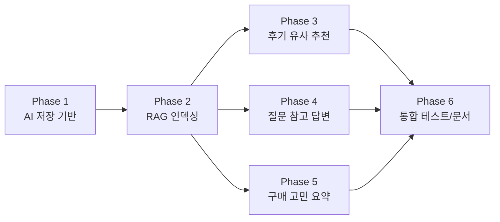

# RAG 구현 시작 전에 읽는 Phase 1~6 흐름

이 문서는 AI Phase 1~6을 구현하기 전에 읽는 안내서다. 목표는 "어떤 파일을 만든다"를 외우는 것이 아니라, 각 Phase가 RAG(Retrieval-Augmented Generation) 흐름의 어느 부분을 담당하는지 이해하는 것이다.

이번 프로젝트의 AI 기능은 자유 질문형 챗봇이 아니다. 게시글 상세 맥락 안에서만 동작한다.

- 후기 게시판: 현재 후기와 유사한 후기 게시글 추천
- 질문 게시판: 과거 질문/댓글 근거 기반 AI 참고 답변
- 구매 고민 게시판: 관련 후기 요약과 비슷한 가격대 추천

핵심 원칙은 하나다.

> AI가 새 지식을 마음대로 만들어내는 것이 아니라, 우리 서비스에 저장된 게시글과 댓글을 먼저 검색하고, 그 근거를 바탕으로 답변하거나 추천한다.

## 1. RAG를 한 문장으로 이해하기

RAG는 크게 두 단계로 나뉜다.

```text
Retrieval: 우리 DB의 게시글/댓글 중 관련 근거를 찾는다.
Generation: 찾은 근거를 LLM에게 함께 주고 답변이나 요약을 만든다.
```

조금 더 구현 흐름에 가깝게 쓰면 다음과 같다.

```text
게시글/댓글 원본
-> LangChain Document 변환
-> Text Splitter로 chunk 분리
-> Embedding 생성
-> Vector Store 저장
-> 사용자 요청
-> Retriever로 관련 chunk 검색
-> Prompt에 context와 요청 맥락 삽입
-> LLM 답변 생성
-> AiOutput과 sources 저장 또는 추천 결과 반환
```

여기서 중요한 점은 "검색 가능한 데이터"와 "사용자가 보는 원본 데이터"를 구분하는 것이다.

- 원본 데이터: `Post`, `Comment`, `PostFigureInfo`, `Tag`
- 검색 인덱스: `ContentChunk`와 Vector Store
- AI 결과: `AiOutput`, `AiOutputSource`

이 세 층을 분리해야 나중에 수정, 재인덱싱, 근거 표시, 오류 추적이 쉬워진다.

## 2. Phase 1~6 전체 지도



Phase 1은 RAG 결과와 근거를 저장할 DB 기반을 만든다. Phase 2는 게시글/댓글을 검색 가능한 형태로 바꾼다. Phase 3~5는 같은 검색 기반을 서로 다른 사용자 기능으로 연결한다. Phase 6은 세 기능이 설계 의도대로 동작하는지 검증하고 문서화한다.

## 3. RAG 구성 요소와 프로젝트 파일 연결

| RAG 개념 | 하는 일 | 프로젝트에서 볼 파일 |
| --- | --- | --- |
| Document | DB의 게시글/댓글을 LangChain이 처리할 수 있는 문서로 바꾼다. | `backend/app/ai/rag/document_loader.py` |
| Text Splitter | 긴 본문을 검색하기 좋은 chunk 단위로 나눈다. | `backend/app/ai/rag/text_splitter.py` |
| Embedding | 텍스트를 의미 벡터로 변환한다. | `backend/app/ai/rag/embedding_client.py` |
| Vector Store | 벡터를 저장하고 유사도 검색을 수행한다. | `backend/app/ai/rag/vector_store.py` |
| ContentChunk | 어떤 chunk가 어떤 게시글/댓글에서 왔는지 DB에 기록한다. | `backend/app/models/content_chunk.py` |
| Retriever | 기능별 조건에 맞는 관련 chunk를 찾는다. | `backend/app/ai/rag/retriever.py` |
| Prompt | 검색한 근거와 현재 게시글 맥락을 LLM 입력으로 정리한다. | `backend/app/ai/llm/prompts.py` |
| LLM | 근거 기반 답변, 요약, 추천 문장을 생성한다. | `backend/app/ai/llm/llm_client.py` |
| AiOutput | 생성된 AI 답변을 사용자 댓글과 분리해서 저장한다. | `backend/app/models/ai_output.py` |
| AiOutputSource | AI가 참고한 게시글/댓글/chunk 근거를 저장한다. | `backend/app/models/ai_output_source.py` |

## 4. Phase 1. AI 공통 DB 모델과 schema

Phase 1은 LangChain 코드를 많이 쓰는 단계가 아니다. 대신 RAG 결과를 서비스 안에서 안전하게 다루기 위한 저장 기반을 만든다.

구현 대상은 다음 세 가지다.

- `ContentChunk`: 검색용 chunk의 DB 기록
- `AiOutput`: 질문 참고 답변, 구매 고민 요약 같은 AI 결과
- `AiOutputSource`: AI 결과가 참고한 근거 목록

### RAG 개념과 연결하기

RAG에서 "근거 기반"이라는 말은 단순히 프롬프트에 참고 문서를 넣는 것만 뜻하지 않는다. 사용자가 나중에 AI 답변을 볼 때 "이 답변이 어떤 게시글과 댓글을 근거로 만들어졌는지" 확인할 수 있어야 한다.

그래서 Phase 1은 다음 질문에 답한다.

- AI 답변을 사용자 댓글과 어떻게 분리할까?
- AI 답변 생성 상태를 어떻게 관리할까?
- 어떤 게시글/댓글/chunk를 근거로 썼는지 어떻게 보여줄까?
- 근거가 부족한 답변과 충분한 답변을 어떻게 구분할까?

`AiOutput.status`는 생성 작업의 상태를 표현한다.

```text
REQUESTED -> PROCESSING -> GENERATED
                         -> FAILED
```

`grounding_status`는 답변의 근거 품질을 표현한다.

```text
GROUNDED: 충분한 근거로 답변함
PARTIALLY_GROUNDED: 일부 근거는 있지만 제한적임
NO_EVIDENCE: 관련 근거가 부족함
```

유사 후기 추천은 `AiOutput`으로 저장하지 않는다. 추천은 현재 게시글, 새로 추가된 후기, 검색 인덱스 상태에 따라 계속 달라질 수 있으므로 실시간 계산이 더 자연스럽다.

## 5. Phase 2. RAG 인덱싱

Phase 2는 RAG의 "Retrieval을 준비하는 단계"다. 사용자가 AI 기능을 요청하기 전에, 게시글과 댓글을 검색 가능한 형태로 미리 만들어 둔다.

흐름은 다음과 같다.

```text
Post/Comment 조회
-> Document 생성
-> chunk 분리
-> embedding 생성
-> Vector Store 저장
-> ContentChunk 기록
```

### 왜 chunk가 필요한가

게시글 하나가 길어질수록 전체 본문을 한 번에 검색하거나 LLM에게 전달하기 어렵다. 또한 질문과 관련 있는 부분이 본문 전체가 아니라 특정 문단일 수 있다.

그래서 긴 글을 작은 조각으로 나눈다. 이 조각이 chunk다.

예를 들어 후기 게시글이 다음 내용을 담고 있다고 하자.

```text
제목: 넨도로이드 A 후기
본문: 얼굴 파츠는 좋았지만 도색 마감은 아쉬웠다...
피규어명: A
제조사: Good Smile Company
가격대: 50000_100000
만족도: 4
태그: 넨도로이드, 초보추천
```

이 글은 `Document`가 되고, 본문이 길면 여러 chunk로 나뉜다. 각 chunk metadata에는 `post_id`, `board_code`, `source_type`, `figure_name`, `manufacturer`, `price_range`, `satisfaction_score`, `tags` 같은 검색 보조 정보가 들어간다.

### Embedding과 Vector Store의 역할

Embedding은 텍스트를 숫자 벡터로 바꾸는 일이다. 벡터로 바꾸면 "같은 단어가 있느냐"뿐 아니라 "의미가 비슷하냐"를 기준으로 검색할 수 있다.

Vector Store는 이 벡터들을 저장하고, 새 요청이 들어왔을 때 비슷한 벡터를 빠르게 찾는다.

```text
"도색 마감이 좋은 피규어 후기"
-> embedding
-> vector search
-> 도색, 마감, 품질 관련 chunk 검색
```

### 수정과 재인덱싱

게시글이나 댓글이 수정되면 기존 chunk를 그대로 두면 안 된다. 검색 결과에 예전 내용이 섞일 수 있기 때문이다.

따라서 수정 시에는 기존 chunk를 `STALE` 처리하고, 최신 내용으로 다시 인덱싱한다.

```text
기존 chunk ACTIVE
-> 게시글 수정
-> 기존 chunk STALE
-> 새 chunk ACTIVE
```

이 흐름은 검색 결과의 신뢰도를 지키기 위한 기본 장치다.

## 6. Phase 3. 후기 게시판 유사 피규어 추천

Phase 3은 RAG 중에서 Retrieval을 사용자 기능으로 바로 쓰는 단계다. LLM으로 긴 답변을 만들기보다는, 현재 후기와 비슷한 후기를 찾아 추천 목록으로 보여준다.

API는 다음 형태다.

```text
GET /api/v1/posts/{post_id}/similar-posts?limit=3
```

흐름은 다음과 같다.

```text
현재 REVIEW 게시글 조회
-> 제목/본문/피규어명/제조사/태그/가격대 검색 문맥 생성
-> REVIEW chunk만 vector search
-> 현재 게시글 제외
-> metadata와 유사도 기반으로 정렬
-> 추천 목록 반환
```

### RAG 개념과 연결하기

이 단계는 "검색만 있는 RAG"에 가깝다. Generation이 없거나 매우 약하다. 추천 이유 문장을 만들더라도 핵심은 Retriever가 관련 후기를 찾아오는 데 있다.

여기서 중요한 것은 metadata filter다.

- `board_code = REVIEW`인 chunk만 검색한다.
- 현재 `post_id`는 제외한다.
- 같은 피규어명, 제조사, 태그, 가격대가 겹치면 더 좋은 후보로 볼 수 있다.

추천 결과를 저장하지 않는 이유도 RAG 관점에서 자연스럽다. 새 후기가 추가되면 추천 결과는 달라질 수 있다. 그래서 이 기능은 "현재 인덱스 기준 실시간 검색 결과"로 다루는 편이 좋다.

## 7. Phase 4. 질문 게시판 과거 답변 기반 AI 참고 답변

Phase 4는 전형적인 RAG 답변 생성 단계다.

API는 다음 형태다.

```text
POST /api/v1/posts/{post_id}/ai/reference-answer
GET /api/v1/ai/outputs/{ai_output_id}
```

흐름은 다음과 같다.

```text
현재 QUESTION 게시글 조회
-> 질문 제목/본문을 검색 query로 구성
-> 과거 QUESTION 게시글과 댓글 chunk 검색
-> 검색 결과가 부족하면 fallback
-> 검색 결과가 있으면 context 구성
-> Prompt에 현재 질문과 context 삽입
-> LLM이 참고 답변 생성
-> AiOutput 저장
-> AiOutputSource 저장
-> 응답 반환
```

### 왜 댓글로 저장하지 않는가

AI 참고 답변은 사용자 댓글이 아니다. 사용자가 직접 쓴 답변과 AI가 생성한 참고 답변이 섞이면 신뢰도와 책임 경계가 흐려진다.

그래서 AI 답변은 `AiOutput`에 저장하고, 화면에서도 댓글과 다른 영역에 표시한다.

### 왜 sources가 필요한가

질문 답변 기능에서 가장 중요한 것은 "그럴듯한 답변"이 아니라 "근거가 있는 답변"이다.

따라서 답변과 함께 다음 정보를 제공해야 한다.

- 참고한 게시글
- 참고한 댓글
- 참고한 chunk
- 유사도 또는 근거 요약

근거가 부족하면 다음처럼 솔직하게 제한된 응답을 반환해야 한다.

```json
{
  "answer": "관련 게시글이나 댓글 근거가 부족해 답변을 생성할 수 없습니다.",
  "sources": []
}
```

이 fallback은 실패가 아니라 RAG 품질을 지키는 정상 동작이다.

## 8. Phase 5. 구매 고민 게시판 요약과 추천

Phase 5는 Phase 4보다 검색 전략이 조금 더 복합적이다. 질문 답변은 "비슷한 질문과 답변을 찾아 답한다"에 가깝지만, 구매 고민은 다음 두 가지를 함께 해야 한다.

- 동일 피규어 또는 관련 피규어 후기 요약
- 비슷한 가격대에서 만족도 높은 후기 추천

API는 다음 형태다.

```text
POST /api/v1/posts/{post_id}/ai/purchase-summary
GET /api/v1/ai/outputs/{ai_output_id}
```

흐름은 다음과 같다.

```text
현재 PURCHASE_HELP 게시글 조회
-> 제목/본문에서 구매 고민 맥락 구성
-> REVIEW chunk 검색
-> 동일 피규어/제조사/태그/가격대 metadata 활용
-> 근거가 있으면 장점/단점/주의점 요약
-> 동일 피규어 근거가 부족하면 유사 가격대 고만족 후기 추천
-> AiOutput과 AiOutputSource 저장
```

### RAG 개념과 연결하기

구매 고민 기능은 Retrieval과 Generation이 둘 다 중요하다.

Retrieval에서는 다음 조건이 중요하다.

- 구매 고민 글은 `PURCHASE_HELP`이지만, 근거는 주로 `REVIEW`에서 찾는다.
- 가격대와 만족도는 metadata로 활용한다.
- 같은 피규어명이 있으면 가장 강한 근거로 본다.
- 같은 피규어가 없어도 제조사, 태그, 가격대가 비슷한 후기는 보조 근거가 될 수 있다.

Generation에서는 답변 형식이 중요하다.

- 동일 피규어 후기 요약
- 장점
- 단점 또는 주의점
- 추천할 만한 유사 가격대 후기
- 근거 부족 여부
- sources

구매를 단정적으로 강요하지 않고, 사용자가 판단할 수 있는 보조 정보로 작성해야 한다.

## 9. Phase 6. 통합 테스트와 문서 정리

Phase 6은 "코드가 실행된다"를 넘어서 "RAG 흐름이 믿을 만하게 작동한다"를 확인하는 단계다.

검증해야 하는 질문은 다음과 같다.

- 인덱싱하지 않은 상태에서 AI 기능이 요청되면 적절히 실패하거나 fallback되는가?
- 재인덱싱 후 수정된 게시글 내용이 검색에 반영되는가?
- 후기 추천에서 현재 게시글이 제외되는가?
- 질문 답변에서 근거가 부족할 때 억지 답변을 만들지 않는가?
- 구매 고민에서 동일 피규어 후기를 우선하고, 부족하면 유사 가격대 후기로 넘어가는가?
- AI 답변과 사용자 댓글이 화면과 DB에서 분리되는가?
- 응답에 sources가 포함되는가?

문서로는 `docs/rag-study.md`를 완성한다. `start-rag.md`가 구현 전 지도라면, `rag-study.md`는 구현 후 해설서다.

## 10. 세 기능은 같은 RAG 기반을 다르게 쓴다

| 기능 | 검색 대상 | 생성 여부 | 저장 여부 | 핵심 차이 |
| --- | --- | --- | --- | --- |
| 유사 후기 추천 | `REVIEW` 게시글 chunk | 거의 없음 | 저장하지 않음 | 현재 후기와 비슷한 후기를 실시간 추천 |
| 질문 참고 답변 | `QUESTION` 게시글과 댓글 chunk | 있음 | `AiOutput` 저장 | 과거 질문/댓글 근거로 참고 답변 생성 |
| 구매 고민 요약 | 주로 `REVIEW` 게시글 chunk | 있음 | `AiOutput` 저장 | 동일 피규어 후기 요약과 유사 가격대 추천 |

세 기능 모두 같은 RAG 부품을 쓴다.

```text
Document
-> TextSplitter
-> Embedding
-> Vector Store
-> Retriever
```

하지만 사용자에게 보여주는 결과는 다르다.

- 추천 기능은 검색 결과를 목록으로 보여준다.
- 답변 기능은 검색 결과를 context로 넣어 LLM 답변을 만든다.
- 요약 기능은 여러 근거를 구조화해 장점/단점/추천으로 정리한다.

## 11. 구현 순서로 다시 보기

실제로 코드를 작성할 때는 다음 순서가 가장 읽기 쉽다.

1. Phase 1에서 `ContentChunk`, `AiOutput`, `AiOutputSource`를 만든다.
2. Phase 2에서 게시글/댓글을 `Document`로 만들고 chunk, embedding, vector 저장을 구현한다.
3. 내부 인덱싱 API와 재인덱싱 스크립트로 검색 인덱스를 채운다.
4. Phase 3에서 Retriever를 이용해 유사 후기 추천을 만든다.
5. Phase 4에서 Retriever, Prompt, LLM, AiOutput 저장을 연결해 질문 참고 답변을 만든다.
6. Phase 5에서 구매 고민용 검색 전략과 요약 prompt를 만든다.
7. Phase 6에서 세 흐름을 테스트하고 `docs/rag-study.md`를 작성한다.

이 순서를 지키면 RAG가 갑자기 "AI 호출 코드"로 보이지 않는다. 먼저 근거를 저장하고, 다음에 검색 가능한 형태로 만들고, 마지막에 그 근거를 사용자 기능으로 연결하는 흐름이 된다.

## 12. 구현 전 체크리스트

Phase를 시작하기 전에 다음을 확인한다.

- `docs/architecture/api-design.md`에서 API 경로와 응답 형태를 확인한다.
- `docs/database/schema-design.md`에서 AI 관련 테이블과 기존 게시글/댓글 관계를 확인한다.
- `docs/testing/test-scenarios.md`에서 검증 시나리오를 확인한다.
- OpenAI API key와 모델명은 코드에 하드코딩하지 않는다.
- 독립 자유 질문형 `POST /api/v1/ai/qna`는 만들지 않는다.
- AI 답변은 댓글로 저장하지 않는다.
- 게시글 작성 화면에 URL 입력칸이나 외부 링크 미리보기 흐름을 추가하지 않는다.

## 13. 처음 구현할 때 기억할 말

RAG 구현의 핵심은 LLM을 잘 호출하는 코드가 아니다. 핵심은 "어떤 원본 데이터를 어떤 근거 조각으로 만들고, 그 근거를 어떻게 찾아서, 사용자에게 어떻게 투명하게 보여줄 것인가"다.

그래서 Phase 1~2가 단단해야 Phase 3~5가 단순해진다. 저장 구조와 인덱싱 흐름이 명확하면, 후기 추천과 질문 답변과 구매 고민 요약은 같은 기반 위에 얹히는 서로 다른 usecase가 된다.
